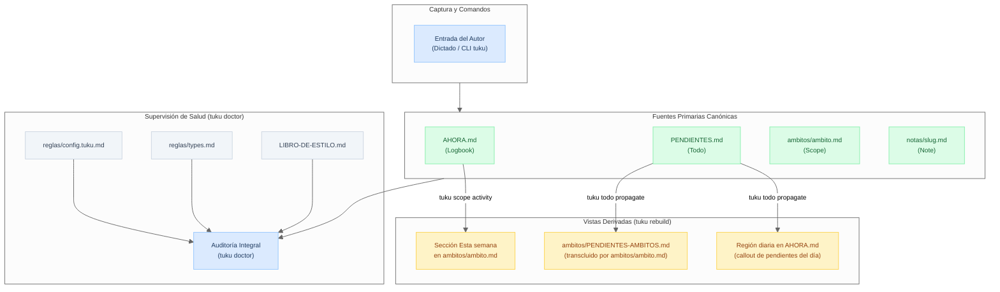

# Mapa de Dependencias y Cableado de TUKU

> Mapa arquitectónico de alta velocidad. Conecta cada artefacto del vault con su plantilla, su especificación normativa, los módulos de producción en Python y su flujo de datos canónico y derivado.

## 1. Principios de Cableado

- **Canónico vs. Derivado ([P6](docs/principios.md#L55), [P9](docs/principios.md#L79)):** El conjunto canónico (`AHORA.md`, `PENDIENTES.md`, notas, páginas de ámbito) es la única fuente de verdad y nunca se regenera. Los archivos y regiones derivadas se borran y reconstruyen idénticos con `tuku rebuild`.
- **Tres capas de implementación ([`DEVEL.md`](DEVEL.md#L37)):**
  1. *Núcleo puro (`src/tuku/<noun>.py`):* transformaciones puras de texto en memoria sin I/O.
  2. *Casos de uso (`<noun>.*_en_vault`):* lectura, mutación pura, escritura y retorno de `Resultado`.
  3. *CLI (`src/tuku/cli/`):* `argparse` e impresión de cara al usuario.
- **Contrato de tipos OKF ([`reglas/types.md`](template/vanilla/reglas/types.md)):** Todo Markdown del vault declara su `type:` normativo reconocido por `tuku doctor`.

---

## 2. Matriz de Artefactos del Vault

| Artefacto en el Vault | Naturaleza / `type:` | Plantilla (`template/vanilla/`) | Spec Normativa (`spec/`) | Módulos de Producción (`src/tuku/`) | Flujo de Datos (Lee / Escribe) |
|---|---|---|---|---|---|
| **`AHORA.md`** | Canónico + Derivado (`Logbook`) | [`reglas/plantilla/AHORA.md`](../template/vanilla/reglas/plantilla/AHORA.md) | [`bitacora.md`](../spec/bitacora.md), [`ciclo.md`](../spec/ciclo.md) | [`entry.py`](../src/tuku/entry.py), [`ahora.py`](../src/tuku/ahora.py), [`propagate.py`](../src/tuku/propagate.py), [`cycle.py`](../src/tuku/cycle.py) | **Escribe:** `tuku entry add`, `tuku cycle open`. **Propaga:** `tuku todo propagate` inyecta callouts diarios. |
| **`PENDIENTES.md`** | Canónico (`Todo`) | [`PENDIENTES.md`](../template/vanilla/PENDIENTES.md) | [`pendientes.md`](../spec/pendientes.md) | [`todo.py`](../src/tuku/todo.py), [`cli/todo.py`](../src/tuku/cli/todo.py) | **Escribe:** `tuku todo open`, `tuku todo close`. **Dispara:** regeneración de vistas derivadas. |
| **`ambitos/PENDIENTES-AMBITOS.md`** | Derivado (`Derived`) | [`ambitos/PENDIENTES-AMBITOS.md`](../template/vanilla/ambitos/PENDIENTES-AMBITOS.md) | [`pendientes.md`](../spec/pendientes.md), [`ambitos.md`](../spec/ambitos.md) | [`propagate.py`](../src/tuku/propagate.py), [`rebuild.py`](../src/tuku/rebuild.py), [`scope.py`](../src/tuku/scope.py) | **Lee:** `PENDIENTES.md`, árbol `ambitos/`. **Escribe:** `tuku todo propagate`, `tuku rebuild`. |
| **`ambitos/<nom>/<nom>.md`** | Canónico + Derivado (`Scope`) | [`ambitos/personal/personal.md`](../template/vanilla/ambitos/personal/personal.md) | [`ambitos.md`](../spec/ambitos.md) | [`scope.py`](../src/tuku/scope.py), [`link.py`](../src/tuku/link.py), [`rebuild.py`](../src/tuku/rebuild.py) | **Crea:** `tuku scope create`. **Transcluye:** `PENDIENTES-AMBITOS.md`. **Deriva:** sección `## Esta semana`. |
| **`ambitos/<nom>/CADENCIAS.md`** | Canónico (`Cadence`) | [`ambitos/CADENCIAS.md`](../template/vanilla/ambitos/CADENCIAS.md) | [`cadencias.md`](../spec/cadencias.md) | [`cadence.py`](../src/tuku/cadence.py) *(futuro epic 006)* | **Lee:** `tuku cycle open` para emitir al abrir ciclo. |
| **`ambitos/<nom>/CAPACIDAD.md`** | Canónico (`Capacity`) | [`ambitos/personal/CAPACIDAD.md`](../template/vanilla/ambitos/personal/CAPACIDAD.md) | [`ambitos.md`](../spec/ambitos.md), [`ciclo.md`](../spec/ciclo.md) | [`capacity.py`](../src/tuku/capacity.py) *(futuro epic 006)* | **Lee:** plan y balance de ciclo. |
| **`notas/<slug>.md`** | Canónico (`Note`) | *(Generada dinámicamente con OKF)* | [`notas.md`](../spec/notas.md) | [`note.py`](../src/tuku/note.py), [`cli/note.py`](../src/tuku/cli/note.py) | **Escribe:** `tuku note create`. **Valida:** `tuku note lint` (`## Ver además`). |
| **`LIBRO-DE-ESTILO.md`** | Canónico (`Style Guide`) | [`LIBRO-DE-ESTILO.md`](../template/vanilla/LIBRO-DE-ESTILO.md) | [`bitacora.md`](../spec/bitacora.md), [`spec/README.md`](../spec/README.md) | [`style.py`](../src/tuku/style.py), [`vocab.py`](../src/tuku/vocab.py) | **Lee:** clasificaciones, horizontes, identidad de autor. |
| **`reglas/config.tuku.md`** | Canónico (`Config`) | [`reglas/config.tuku.md`](../template/vanilla/reglas/config.tuku.md) | [`spec/README.md`](../spec/README.md) | [`config.py`](../src/tuku/config.py), [`init.py`](../src/tuku/init.py) | **Lee:** `TZ`, `cycle_type`, `tuku_template`. |
| **`reglas/types.md`** | Canónico (`Config`) | [`reglas/types.md`](../template/vanilla/reglas/types.md) | [`spec/README.md`](../spec/README.md) | [`doctor.py`](../src/tuku/doctor.py) | **Valida:** catálogo estricto de tipos OKF válidos. |
| **`AGENTS.md` (raíz y ramas)** | Instrucción operativa (Sin frontmatter) | [`AGENTS.md`](../template/vanilla/AGENTS.md), [`ambitos/AGENTS.md`](../template/vanilla/ambitos/AGENTS.md) | [`despacho.md`](../spec/despacho.md), [`agente.md`](../spec/agente.md) | [`doctor.py`](../src/tuku/doctor.py) | **Gobierna:** conducta de agentes; enrutamiento de dictados. |

---

## 3. Grafo de Propagación y Dependencias

---

## 4. Cadena de Empaquetado y Distribución

Cuando se modifica cualquier archivo en `template/vanilla/`:

1. **Fuente editable:** [`template/vanilla/`](../template/vanilla/)
2. **Script de sincronización:** [`src/tuku/_pack.py`](../src/tuku/_pack.py) (o `python -m tuku._pack`)
3. **Destino empaquetado:** `src/tuku/_home/` (ignorado en git, viaja dentro del wheel)
4. **Instalador:** [`src/tuku/init.py`](../src/tuku/init.py) (`resolver_home()`) copia `_home/` al inicializar un vault nuevo (`tuku init`).

---

## 5. Regla de Impacto Rápido ante Cambios

Antes de modificar un archivo o comportamiento, verificar el cuadrante:

1. **Si cambia una regla de negocio o formato:** Modificar primero [`spec/`](../spec/README.md).
2. **Si cambia una plantilla sembrada:** Modificar [`template/vanilla/`](../template/vanilla/) y sincronizar con `src/tuku/_pack.py`.
3. **Si el archivo es derivado:** Modificar la constante o función constructora en [`src/tuku/propagate.py`](../src/tuku/propagate.py) o [`src/tuku/rebuild.py`](../src/tuku/rebuild.py), nunca solo el archivo en disco.
4. **Si cambia un metadato frontmatter:** Actualizar [`template/vanilla/reglas/types.md`](../template/vanilla/reglas/types.md) para mantener `tuku doctor` en verde.
