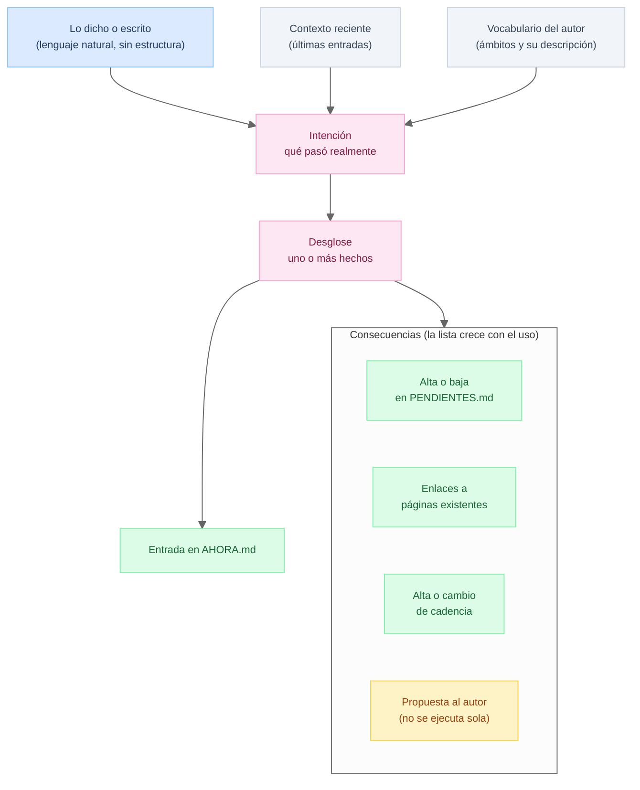

# En qué orden implementar los tests

## Fases

Diez fases. **Cada una termina con un vault que alguien puede usar**, no con una capa que solo le sirve a la siguiente. Si una fase no se puede entregar sola, está mal cortada.

El LLM aparece en los dos extremos y el medio es determinista, que es el principio 4 convertido en plan de trabajo: primero lo que se verifica exacto, al final lo que solo se puede evaluar.

| Fase | Nombre | Qué se puede hacer al terminarla | LLM | Fixture |
| --- | --- | --- | --- | --- |
| 0 | El vault que se puede abrir | Empezar a escribir a mano | no | `vacio` |
| 1 | La entrada | Dictar y que quede bien escrito | sí | `primer-dia` |
| 2 | Pendientes | Que no se olvide nada | no | `ciclo-en-curso` |
| 3 | El árbol de ámbitos | Que cada cosa tenga su lugar | no | `ciclo-en-curso` |
| 4 | Cadencias | Que el sistema recuerde solo | no | `ciclo-en-curso` |
| 5 | Notas y enlaces | Que el tejido se mantenga | no | `ciclo-en-curso` |
| 6 | El ciclo | Abrir y cerrar sin perder nada | no | `ciclo-por-cerrar` |
| 7 | Plan y resumen | Que la propuesta valga la pena leerla | sí | `ciclo-por-cerrar` |
| 8 | Endurecimiento | Usarlo en serio | no | `historico` |
| 9 | Inferencia semántica | Que note cosas que nadie pidió | sí | `historico` |

Cada fase se describe igual, con una sección **No entra** que es lo mismo que TUKU le pide a un plan de ciclo: decir qué se deja fuera y por qué, para que no se arrastre sin darse cuenta.

### Fase 0. El vault que se puede abrir

**Pregunta.** ¿Alguien sin conocimientos de informática puede empezar sin ayuda?

**Se construye.** El árbol del estado cero y lo que lo copia a un directorio limpio. Nada más: no hay janitors, no hay agente, no hay LLM.

**Sale cuando.** Instalar en un directorio vacío produce byte a byte el fixture `vacio`, y una persona que no sabe qué es TUKU abre `AHORA.md`, escribe una línea a mano y no rompe nada.

**No entra.** Decidir el tipo de ciclo real de quien lo usa. Arranca en semanal y el tipo verdadero emerge después.

Es la única fase cuyo criterio de salida **no es técnico**. Se verifica con una persona, no con un diff. Y es la fase que hace verdadero el principio 1: si el vault recién instalado no se puede operar a mano, ninguna fase posterior lo va a arreglar.

### Fase 1. La entrada

**Pregunta.** ¿El dictado se convierte en una línea de bitácora bien formada?

**Se construye.** Inyección de contexto reciente y vocabulario, formateo a `- HH:MM - [[ambito]] ~~(Hecho)~~ **clasificacion**: cuerpo`, inserción en el día correcto y en orden cronológico, y lint.

**Janitors.** `jntr.contexto-reciente`, `jntr.vocabulario-ambitos`, `jntr.entrada-insertar`, `jntr.entrada-lint`

**Sale cuando.** El corpus se reproduce con la ontología cerrada exacta, marca y posición, y con el ámbito correcto. La clasificación abierta se mide aparte y no bloquea la fase, porque es vocabulario del autor y no del sistema.

**No entra.** Ninguna consecuencia. La entrada solo escribe en la bitácora. **Si en esta fase algo toca `PENDIENTES.md`, el corte está mal hecho.**

Esta fase es la que habilita todas las demás: a partir de acá, inyectar un caso de prueba es escribir una línea de texto.

### Fase 2. Pendientes

**Pregunta.** ¿La fuente de verdad se mantiene sola, sin que el autor la ordene?

**Se construye.** Abrir, cerrar, bajar de escalón, vencer, unicidad, sincronía de transclusiones y el reporte por actividad.

**Janitors.** `jntr.pendiente-abrir`, `jntr.pendiente-cerrar`, `jntr.pendiente-mover`, `jntr.pendientes-atrasados`, `jntr.pendientes-lint`, `jntr.transclusiones-sync`, `jntr.pendientes-por-actividad`

**Sale cuando.** Abrir es copiar texto literal y cerrar es borrarlo, sin LLM, gracias a la regla del infinitivo. Ningún pendiente aparece en dos callouts. Correr los janitors dos veces da lo mismo.

**No entra.** Promover entre ciclos. Eso pertenece a abrir un ciclo y no tiene sentido antes de que exista el ciclo siguiente.

Primera fase de inyección pura. Las transclusiones se pueden probar acá porque el estado cero ya trae los días sembrados.

### Fase 3. El árbol de ámbitos

**Pregunta.** ¿Dónde aterriza cada entrada y qué regla manda?

**Se construye.** Los tres roles (ámbito, categoría, actividad), la creación, la obligatoriedad de `AGENTS.md` y `CADENCIAS.md`, la resolución de reglas por cercanía, el archivado y la reescritura de enlaces.

**Janitors.** `jntr.ambito-crear`, `jntr.ambitos-lint`, `jntr.reglas-resolver`, `jntr.paginas-index`, `jntr.archivar`, `jntr.enlaces-reescribir`, `jntr.ambitos-inactivos`

**Sale cuando.** Con un fixture de tres niveles se comprueba que la regla más cercana gana. Una entrada nunca apunta a una categoría. Archivar deja resolviendo los enlaces desde bitácoras ya cerradas.

**No entra.** La deliberación con el autor antes de archivar. Acá se implementa la mecánica; decidir que una rama se cierra no es código.

### Fase 4. Cadencias

**Pregunta.** ¿El sistema sabe recordar por su cuenta?

**Se construye.** Alta desde una entrada, colecta desde el árbol, resolución del trigger (calendario más tipo de ciclo), inyección en el día que corresponde y el reporte del autor.

**Janitors.** `jntr.cadencia-alta`, `jntr.cadencias-colectar`, `jntr.cadencias-resolver`, `jntr.cadencia-inyectar`, `jntr.cadencias-reporte`

**Sale cuando.** Las cadencias reales de `mac-jpgil` se expresan en el formato sin perder información, incluidas las de rango que cruzan el borde de mes y las tres que caen el día 10. Inyectar dos veces no duplica lo emitido.

**No entra.** Inferir cadencias implícitas del histórico. Eso es fase 9.

Primera fase con un banco de pruebas real y no inventado. **Si una cadencia del autor no cabe en el formato, el formato está incompleto**, y eso se descubre acá o no se descubre.

### Fase 5. Notas y enlaces

**Pregunta.** ¿El tejido se mantiene sin que el autor lo teja a mano?

**Se construye.** Notas tipadas, conversión de menciones en enlaces, `index.md` desde los frontmatter, detección de enlaces rotos y notas huérfanas.

**Janitors.** `jntr.menciones-enlazar`, `jntr.notas-index`, `jntr.notas-lint`, `jntr.enlaces-lint`

**Sale cuando.** Crear una nota tipada y enlazarla desde una entrada es determinista. Todo `[[enlace]]` resuelve. El index se regenera igual dos veces.

**No entra.** Destilar el histórico y proponer notas nuevas. Ambas son inferencia y van a la fase 9. Acá solo la mecánica del tejido.

### Fase 6. El ciclo

**Pregunta.** ¿Se puede abrir y cerrar un ciclo sin perder nada?

**Se construye.** Las dos secuencias ordenadas completas, la promoción de pendientes entre ciclos, el aplanado de transclusiones y el archivo.

**Janitors.** `jntr.ciclo-abrir`, `jntr.pendientes-promover`, `jntr.transclusiones-aplanar`, `jntr.ciclo-cerrar`

**Sale cuando.** Abrir dos veces no duplica días, pendientes ni emisiones. Cerrar dos veces no vuelve a mover. Y hay una prueba que **falla a propósito** si se aplana antes de generar el resumen, porque ese es el orden que importa y sin prueba se pierde.

**No entra.** Generar el plan y el resumen. Entran como archivos inyectados, no producidos.

Ese es el truco de corte de esta fase: **el cierre se prueba entero antes de que exista quien escriba el resumen**, y la fase 7 reemplaza los archivos falsos por los de verdad sin tocar la mecánica. Además, el ciclo compone todo lo anterior, así que es acá donde van a aparecer los defectos de las fases 2 a 5.

### Fase 7. Plan y resumen

**Pregunta.** ¿La propuesta que hace el sistema vale la pena leerla?

**Se construye.** Cálculo de capacidad, plan con sus cuatro secciones, "no entra" con su efecto sobre pendientes y alertas, registro del delta, y resumen con sus cinco secciones y su veredicto por intención.

**Janitors.** `jntr.capacidad-calcular`, `jntr.plan-no-entra`, `jntr.plan-delta`, `jntr.ciclo-extracto`

**Sale cuando.** La capacidad se calcula restando el costo fijo y no sobre horas brutas. El veredicto sale de comparar plan contra ejecución, lo que se verifica con un caso doble: la misma actividad contra un plan cumplido y contra uno incumplido tiene que dar veredictos distintos. El delta queda registrado, incluso cuando es cero.

**No entra.** Juzgar la calidad de la prosa.

Primera fase donde el criterio de salida **se parte en dos**: lo que se verifica con script (secciones presentes, veredicto correcto, capacidad bien restada) y lo que solo se evalúa. Conviene decirlo en vez de fingir que todo se puede afirmar.

### Fase 8. Endurecimiento

**Pregunta.** ¿Aguanta el uso real y el error humano?

**Se construye.** Los casos de error, la reconstrucción completa y la idempotencia medida sobre todo el sistema junto y no janitor por janitor.

**Janitors.** `jntr.reconstruir`, y todos los lint corriendo a la vez.

**Sale cuando.** Borrar todo lo derivado y regenerarlo devuelve byte a byte lo mismo. El conjunto canónico (`AHORA.md`, `bitacoras/`, `PENDIENTES.md`, `ambitos/`, `notas/`) no se toca nunca. Y cada caso de error produce un reporte, no una excepción.

**No entra.** Nada nuevo. Esta fase no agrega capacidades, cierra huecos.

La regla que gobierna la fase: **un error del autor nunca se rechaza, se reporta.** Rechazar lo que alguien acaba de dictar es la forma más rápida de que deje de usar TUKU.

### Fase 9. Inferencia semántica

**Pregunta.** ¿El sistema nota cosas que el autor no pidió?

**Se construye.** Detección de recurrencias, destilado de notas tipadas desde el histórico en contexto aislado, inferencia de cadencias implícitas, prioridades por ámbito y el ciclo de propuesta y aprobación.

**Janitors.** `jntr.recurrencias`, `jntr.nota-destilar`, `jntr.periodicidad`

**Sale cuando.** No hay criterio byte a byte para lo que propone. Se mide por la proporción de propuestas que el autor acepta, y esa medición solo tiene sentido después de varios ciclos de uso real.

**No entra.** Ejecutar cualquier cosa sin aprobación.

**La única prueba dura de esta fase es negativa:** rechazar una propuesta no deja rastro en ninguna primitiva, y eso sí se verifica con diff. Es la traducción a prueba del principio 3, y es lo que permite que el resto de la fase sea difuso sin ser peligroso.

### Qué corta las fases

Tres criterios, en este orden:

1. **Entregable solo.** Cada fase deja algo usable. Es lo que permite parar en cualquier punto sin quedarse con un sistema a medio construir.
2. **Un fixture nuevo por vez.** Una fase que necesita dos estados iniciales nuevos está haciendo dos cosas.
3. **El LLM se aísla.** Las fases 1, 7 y 9 lo usan y las demás no. Que estén separadas es lo que deja medir cuánto del sistema depende de un modelo, y ese número debería ser chico.

### Lo que atraviesa todas las fases

- **Idempotencia.** Ninguna fase cierra sin que correr sus operaciones dos veces dé el mismo resultado.
- **Diff byte a byte.** Es la verificación del principio 9 y sale gratis en cada prueba.
- **El campo "A mano".** Ningún janitor entra sin él. Un janitor sin ese campo es una dependencia disfrazada.

## Arbol de directorios

```text
AGENTS.md                     # reglas de todo el repo
LIBRO-DE-ESTILO.md            # reglas del autor, canónico
AHORA.md                      # ciclo en curso
PENDIENTES.md                 # fuente de verdad
log.md                        # generado, OKF compliant
index.md                      # generado, OKF compliant

bitacoras/                    # ciclos cerrados, inmutables
  bitacora-2026-08-25-2026-09-01.md

ambitos/                      # el árbol de la vida
  AGENTS.md                   # reglas de toda la rama
  CADENCIAS.md                # cadencias de toda la rama
  personal/
    AGENTS.md
    CADENCIAS.md
    personal.md               # página propia: es ámbito
  trabajo/
    AGENTS.md
    CADENCIAS.md
    trabajo.md
    clientes/                 # sin página: es categoría
      AGENTS.md
      CADENCIAS.md
      juanito_perez.md        # hoja: recibe entradas

notas/                        # zettelkasten, formato libre

reglas/                       # una regla por consecuencia
  pendientes.tuku.md
  enlaces.tuku.md
  cadencias.tuku.md
  propuestas.tuku.md
  janitors.tuku.md            # qué hace cada janitor
  config.tuku.md              # zona horaria, tipos de ciclo
  tipos/                      # una por tipo de nota
    persona.tuku.md

planes/                       # un plan por ciclo
  plan-2026-08-25-turno.md

reportes/                     # generados, el autor los lee
  resumen-2026-08-25-turno.md
  pendientes-por-actividad.md
  cadencias.md                # todas, colectadas del árbol

archivado/                    # ramas cerradas, enlaces vivos
```

**MAYÚSCULAS es de TUKU**, minúsculas es del autor. Se lee del árbol sin explicación.

Y no hay nada más en el disco. **Todo lo que existe, el autor lo puede abrir y leer.** No hay carpeta de cache ni archivos de máquina.

El contexto reciente y el vocabulario de ámbitos no son archivos: son la **salida de un janitor**, que se calcula cuando hace falta y se inyecta. Materializarlos solo agregaría copias que envejecen, porque una cola de bitácora queda vieja apenas se escribe la entrada siguiente. Calcularla en el momento es más simple y además más correcto.

Lo que sí se materializa, aunque sea generado, es lo que alguien mira o transcluye: `reportes/pendientes-por-actividad.md` lo transcluyen las páginas de actividad, y `reportes/cadencias.md` es donde el autor ve qué se le viene.

### Dónde viven los janitors

La **especificación** vive en el repositorio: `reglas/janitors.tuku.md` describe en prosa qué debe hacer cada janitor, para que alguien pueda implementarlo en el futuro aunque el código de hoy ya no exista.

El **código** vive fuera, instalado, en `~/.tuku/janitors`. El `AGENTS.md` de la raíz lo declara, así que quien opere el libro lo encuentra en el primer archivo que abre.

La división es la de siempre: **la especificación sobrevive, la implementación se reemplaza.** Un script de 2026 no va a correr en 2046, pero la descripción de lo que hacía sí se va a leer. Y así el repositorio del autor no se vuelve una copia del código de TUKU que después diverge por su cuenta.

Cada janitor se especifica igual:

```markdown
## pendientes-atrasados

**Qué hace:** mueve a `^atrasados` los pendientes con fecha anterior a HOY, estampando el vencimiento.
**Cuándo:** a diario.
**Lee:** `PENDIENTES.md`
**Escribe:** `PENDIENTES.md`
**Regla:** pendientes.tuku.md, vencimiento
**A mano:** mover el ítem al callout `^atrasados` y anotar entre paréntesis la fecha en que vencía.
```

El campo **A mano** no es cortesía documental, es lo que sostiene el principio 1. Si un janitor no se puede ejecutar, el trabajo se hace igual, solo que cuesta más. Un janitor sin ese campo es una dependencia disfrazada.

## Estrategia de pruebas

Registrar una entrada produce **una sola cosa**: texto escrito en la bitácora. Todo lo demás, abrir un pendiente, cerrar otro, emitir cadencias, enlazar, proponer, ocurre **después**, leyendo lo que quedó escrito.

Eso parte el sistema en dos mitades con costos de prueba muy distintos.

**La entrada.** Es lo único que necesita LLM: dictado a línea bien formada. Se prueba contra ground truth, comparando la salida con entradas ya redactadas.

**Todo lo demás.** Reacciona a la bitácora, así que no necesita LLM. Un script inyecta líneas y se observa qué hace el sistema. Determinista, repetible, sin tokens.

El corpus sirve para las dos mitades: la Parte 1 es el dictado de entrada, la Parte 2 es el fixture de inyección.

### Dos puntos de inyección, no uno

Algunas operaciones no se disparan desde la bitácora, porque no son hechos de la vida del autor sino del sistema, y ya decidimos no registrarlas:

| Operación | Cómo se prueba |
| --- | --- |
| Abrir y cerrar pendientes, emitir cadencias, enlazar | Inyectando líneas de bitácora |
| Mover un pendiente de escalón | Invocando el janitor con argumentos |
| Corregir el plan | Idem |
| Aprobar o rechazar una propuesta | Idem |

Las dos vías son scriptables y ninguna necesita LLM.

### Lo que esto le da a la tabla de fases

- **Fase 1**: la entrada. Único punto con LLM y con ground truth.
- **Fases intermedias**: todo lo que reacciona a lo escrito. Inyección, sin LLM.
- **Fase 9**: inferencia semántica. Vuelve el LLM, y ya sin respuesta única.

El LLM aparece en los dos extremos y el medio es determinista. Es el principio 4 convertido en plan de trabajo: primero lo que se verifica exacto, al final lo que solo se puede evaluar.

### El requisito que esto impone

Para que la inyección funcione, **cada consecuencia tiene que ser derivable del texto de la entrada**. Si el contenido de una cadencia sale de la conversación y no de lo escrito, esa vía queda fuera de la plataforma de pruebas.

Es una prueba de diseño además de una de implementación. Si algo no se puede reconstruir desde la bitácora, entonces o a la entrada le falta información, o esa operación pertenece a la segunda vía y hay que decirlo.

### Cada prueba es una transición de estado

Toda prueba tiene la misma forma: un estado inicial de archivos, una operación, y un estado final esperado. La comparación es un diff de directorios y no hace falta más andamiaje.

```text
fixtures/<nombre>/
  inicial/          # el vault antes
  operacion.txt     # la línea a inyectar, o el comando a invocar
  esperado/         # el vault después
```

Que la comparación sea byte a byte no es rigor de más: es la verificación del principio 9. Si un janitor no produce el mismo resultado dos veces, el diff lo delata sin que nadie lo busque.

### El estado cero

El primero y el más importante: **el vault recién instalado**, antes de la primera palabra.

Importa más que los demás porque no es solo un fixture, es el producto. Alguien sin conocimientos de informática tiene que poder abrirlo y empezar sin configurar nada. Es lo que promete el principio 2 y lo que dice el brief: una bitácora en blanco y una pregunta.

```text
AGENTS.md                 # dice dónde viven los janitors
LIBRO-DE-ESTILO.md        # el que trae TUKU, con los vocabularios de partida
AHORA.md                  # días sembrados, sin entradas
PENDIENTES.md             # los cinco callouts de horizonte, vacíos
ambitos/
  AGENTS.md
  CADENCIAS.md
  personal/
    AGENTS.md
    CADENCIAS.md
    personal.md
notas/
reglas/                   # los que trae TUKU
```

Acá se cobra la decisión de que `AGENTS.md` y `CADENCIAS.md` sean obligatorios aunque estén vacíos. En el estado cero **están todos vacíos**, y aun así ningún janitor tiene que manejar el caso "no existe".

**Falta decidir el ciclo del estado cero.** `AHORA.md` necesita `ciclo`, `desde` y `hasta`, pero quien recién parte no tiene turnos ni sabe qué es un ciclo. Lo más razonable es arrancar en semanal, que es el ritmo menos sorprendente, y que el tipo real emerja después. Rotar necesita alguna regla, y esa regla no puede ser una pregunta el primer día.

### La escalera de fixtures

Los estados siguientes no se escriben a mano, se generan reproduciendo operaciones desde el estado cero:

| Fixture | Cómo se llega | Qué habilita probar |
| --- | --- | --- |
| `vacio` | recién instalado | que se pueda empezar |
| `primer-dia` | una entrada | la entrada y sus consecuencias |
| `ciclo-en-curso` | varios días, pendientes en varios escalones, cadencias vigentes | casi todo |
| `ciclo-por-cerrar` | ciclo completo sin cerrar | el cierre |
| `historico` | varios ciclos cerrados | archivado y enlaces viejos |

Generarlos por reproducción en vez de escribirlos tiene un efecto lateral útil: **la escalera es en sí misma una prueba de integración.** Si construir `ciclo-en-curso` desde `vacio` falla, hay un defecto, y aparece antes de correr ninguna prueba individual.

## Orden de las pruebas

De abajo hacia arriba: primero lo que no depende de nada, al final lo que compone todo lo anterior. **Abrir y cerrar un ciclo van al final a propósito**, porque tocan todas las primitivas y su orden interno importa.

Casi ninguna prueba se sostiene sola: la mayoría necesita un janitor que inyecte contexto, busque información o corrija inconsistencias. Van anotados al lado con `→`. Los nombres son la entrada de `reglas/janitors.tuku.md`.

### Entrada
- Inyectar contexto reciente y vocabulario antes de interpretar nada → `jntr.contexto-reciente`, `jntr.vocabulario-ambitos`
- Formatear la entrada. Ambito y clasificacion opcionales según el contexto.
  `- HH:MM - [[ambito]] **clasificacion**: cuerpo`
- La marca de la ontología cerrada va en la misma posición, antes de la clasificación:
  `- HH:MM - [[ambito]] ~~(Hecho)~~ **clasificacion**: cuerpo`
- Inferir ámbitos según el texto → `jntr.vocabulario-ambitos`
- Un dictado con varios hechos produce varias entradas
- Insertar en el día correcto y en orden cronológico, sin reordenar lo ya escrito → `jntr.entrada-insertar`
- Lint → `jntr.entrada-lint`
	- Ontología cerrada estricta, ontología abierta permisiva
	- Un tipo desconocido se reporta para preguntar después, nunca se rechaza

### Pendientes
- Abrir un pendiente desde la bitácora → `jntr.pendiente-abrir`
	- Cae en `^sin-fecha`, con el cuerpo copiado literal de la entrada
- Cerrar un pendiente desde la bitácora → `jntr.pendiente-cerrar`
	- Desaparece del callout donde esté, sin importar el escalón
- Bajar de escalón → `jntr.pendiente-mover`
	- `sin-fecha` → horizonte → fecha exacta, sin registrar el movimiento en la bitácora
- Vencer → `jntr.pendientes-atrasados`
	- Lo fechado antes de HOY pasa a `^atrasados` con el vencimiento estampado
- Unicidad → `jntr.pendientes-lint`
	- Ningún pendiente aparece en dos callouts
- Sincronía de transclusiones → `jntr.transclusiones-sync`
	- Crear, mover o borrar un pendiente deja `AHORA.md` sin cajas de error
	- Y sin pendientes fechados que falten en su día
- Generar `reportes/pendientes-por-actividad.md` desde `PENDIENTES.md` → `jntr.pendientes-por-actividad`
	- Esto permite hacer transclusiones dentro de las paginas de ambito/actividad

### Cadencias
- Especifica una cadencia
	- Se registra como entrada `**cadencia**`
	- Se escribe la cadencia en el ámbito que corresponde → `jntr.cadencia-alta`
	- Se verifica la bitácora actual y se modifica si es necesario, para incluir la nueva cadencia en el día que corresponde → `jntr.cadencia-inyectar`
- El trigger conoce el tipo de ciclo, no solo el calendario → `jntr.cadencias-resolver`
- Colectar las cadencias vigentes desde el árbol → `jntr.cadencias-colectar`
- Publicar la vista del autor en `reportes/cadencias.md` → `jntr.cadencias-reporte`
- Idempotencia
	- Inyectar dos veces la misma cadencia no duplica lo emitido

### Ambitos
- Crear un nuevo ámbito → `jntr.ambito-crear`
- Crear una nueva actividad dentro del ambito
- Crear una nueva categoria dentro de ambito (por ejemplos, trabajo/clientes/juanito_perez.md)
- Todo directorio nace con `AGENTS.md` y `CADENCIAS.md`, aunque vacíos → `jntr.ambitos-lint`
- Agregar reglas específicas por ámbito o categoría
	- La más cercana prevalece → `jntr.reglas-resolver`
- Una entrada nunca apunta a una categoría → `jntr.ambitos-lint`
- Detectar ámbitos activos sin actividad hace mucho → `jntr.ambitos-inactivos`
- Archivar una actividad (terminé el proyecto de streamlit) → `jntr.archivar`
	- Caro.. requiere deliberación con el autor
	- Los enlaces desde bitácoras ya cerradas siguen resolviendo → `jntr.enlaces-reescribir`
- Archivar un ámbito (ya no trabajo en Calzones Bendek) → `jntr.archivar`
	- Caro.. requiere deliberación con el autor

### Notas
- Crear una nota y enlazarla desde una entrada
- Destilar una nota tipada desde el histórico, en contexto aislado → `jntr.nota-destilar`
- Convertir menciones sueltas en enlaces → `jntr.menciones-enlazar`
- Mantener `index.md` desde los frontmatter, OKF compliant → `jntr.notas-index`
- Detectar enlaces rotos y notas huérfanas → `jntr.enlaces-lint`
- "Ver además": presencia de la sección y de texto de motivo → `jntr.notas-lint`

### Enlaces y propuestas
- Enlazar a páginas que ya existen, en el momento de escribir la entrada → `jntr.paginas-index`
- Una propuesta se muestra y espera aprobación, no se ejecuta sola
- Rechazar una propuesta no deja rastro en las primitivas
	- Sin janitor a propósito: una propuesta rechazada no escribe nada, así que no hay nada que limpiar

### Abrir un ciclo
En este orden:

1. Crear `AHORA.md` con frontmatter (`ciclo`, `desde`, `hasta`) → `jntr.ciclo-abrir`
2. Sembrar los días con `## Día, DD de MM` → `jntr.ciclo-abrir`
3. Rodar y promover pendientes: `este-turno` sin fecha rueda, `proximo-turno` promueve → `jntr.pendientes-promover`
4. Colectar cadencias desde el árbol y emitir lo que corresponda → `jntr.cadencias-colectar`, `jntr.cadencias-resolver`, `jntr.cadencia-inyectar`
5. Generar el plan en `planes/` y transcluirlo → `jntr.capacidad-calcular` lo alimenta
6. Transcluir los pendientes de cada día → `jntr.transclusiones-sync`

- Idempotencia: abrir dos veces no duplica días, ni pendientes, ni emisiones

### Cerrar un ciclo
En este orden:

1. Generar el resumen en `reportes/`, que necesita el plan y las entradas todavía vivos → `jntr.ciclo-extracto` lo alimenta
2. Aplanar el plan y los pendientes de cada día → `jntr.transclusiones-aplanar`
3. Dejar el enlace al resumen → `jntr.ciclo-cerrar`
4. Mover a `bitacoras/bitacora-DESDE-HASTA.md` → `jntr.ciclo-cerrar`
5. Dejar `AHORA.md` limpio para el ciclo siguiente → `jntr.ciclo-cerrar`

- El orden importa: aplanar antes de generar el resumen lo deja sin de dónde leer
- Idempotencia: cerrar dos veces no vuelve a mover ni a duplicar

### Planes
- Estructura del plan
	- **Intención del ciclo**: lista corta, cada punto es un ámbito y su acción principal
	- **No entra, y por qué**: la razón es parte del plan, no un comentario
	- **Restricciones y contexto**: lo que acota el ciclo antes de empezar
	- **Señales a vigilar**: qué observar durante el ciclo sin que sea tarea
- Calcular la capacidad antes de planificar → `jntr.capacidad-calcular`
	- Partir de las horas del ciclo y restar el costo fijo: roles operativos, viajes, días con los niños
	- Un rol operativo cuesta horas **por día**, no una vez
	- Se planifica contra lo que queda. Planificar contra las horas brutas es la forma más común de fallar
- Traer al plan
	- Pendientes heredados del ciclo anterior → `jntr.pendientes-promover`
	- Cadencias que caen dentro del ciclo → `jntr.cadencias-resolver`
	- Qué quedó abierto y sin cerrar en el ciclo anterior → `jntr.ciclo-extracto`
- El plan se propone al autor y no se escribe sin su aprobación
- Mover algo a "No entra" pospone sus pendientes y silencia sus alertas de ausencia → `jntr.plan-no-entra`
- Registrar cuánto corrigió el autor el plan propuesto → `jntr.plan-delta`
	- Sin correcciones también es información: dice que la propuesta estuvo bien calibrada

### Análisis
- Al cerrar un ciclo
	- Generar el resumen del ciclo en `reportes/`, y dejar solo el enlace en la bitácora → `jntr.ciclo-extracto`
	- Estructura del resumen
		- **Resumen ejecutivo**: tema dominante del ciclo, qué se logró, dónde está el foco urgente
		- **Veredicto por intención**: cumplida, parcial, en riesgo o sin avance, cada una con su acción siguiente
		- **Desglose por ámbito**: estado, pendientes que siguen abiertos, actividad realizada
		- **Emergente**: lo que ocurrió sin estar en el plan
		- **Momentum y señales**: pocos logros que cambian la trayectoria, y señales que merecen atención más allá del ciclo
	- El veredicto sale de comparar plan contra ejecución, no de resumir la actividad
- Prioridades por ámbito / dir / dir

### Integridad
- Borrar todo lo derivado y regenerarlo devuelve lo mismo → `jntr.reconstruir`
- El conjunto canónico no se regenera: `AHORA.md`, `bitacoras/`, `PENDIENTES.md`, `ambitos/`, `notas/`
- Todo `[[enlace]]` resuelve a una página existente → `jntr.enlaces-lint`
- Archivar no rompe enlaces desde bitácoras ya cerradas → `jntr.enlaces-lint`

### Inferencias
- Detectar que algo recurrente merece nota propia, y de qué tipo → `jntr.recurrencias`
	- Proponer al autor, nunca crearla sola
	- Barrer el histórico en contexto aislado, no en la conversación → `jntr.nota-destilar`
	- Si el tipo es `persona`, no escribir nada que no se le podría mostrar
- Inferir cadencias implícitas estudiando las bitácoras anteriores → `jntr.periodicidad`
- Detectar ámbitos y actividades → `jntr.recurrencias`
- Prioridades por ámbito

### Casos de error
- El ámbito no existe → `jntr.ambitos-lint`
- Se cierra un pendiente que no está abierto, o se cierra dos veces → `jntr.pendientes-lint`
- El dictado es ambiguo y no se puede situar
- Una cadencia emite algo que ya está en el día → `jntr.cadencia-inyectar`
- La entrada cae fuera del rango del ciclo abierto → `jntr.entrada-lint`

## Flujo de la información

El flujo no depende de quién lo ejecute. Debe poder entregarse como instructivo a una persona contratada para llevar la bitácora, y funcionar igual.

**Entran** tres cosas, no solo la voz:

- **Lo que el autor dice o escribe**, en lenguaje natural y sin estructura.
- **El contexto reciente**: las últimas entradas registradas, para no preguntar lo ya sabido ni duplicar lo ya escrito.
- **El vocabulario del autor**: la lista de ámbitos con su descripción, que un janitor extrae de los frontmatter de `ambitos/`.

Las dos últimas no son opcionales. Sin vocabulario el paso 3 es imposible: no se puede elegir ámbito sin saber cuáles existen. Sin contexto reciente se repregunta lo que el autor ya dijo. Una persona nueva necesitaría exactamente lo mismo el primer día.

1. **Se separa lo dirigido al sistema de lo que pasó.** "Recuérdame", "anota", "oye" son instrucciones a quien lleva la bitácora. No son parte del hecho y no se registran.
2. **Se parte en hechos.** Una sola frase puede contener varios: un cierre propio y la respuesta de un tercero son dos hechos distintos.
3. **Cada hecho se sitúa.** A qué ámbito pertenece, a qué hora ocurrió y de qué clase es.
4. **Cada hecho se redacta** como entrada, según las reglas de bitácora.
5. **Se aplican las consecuencias.** Un hecho puede arrastrar efectos más allá de su propia entrada. Cada tipo de consecuencia tiene su archivo de reglas en `reglas/` y se consulta solo cuando corresponde.

**Sale** una o más entradas escritas en `AHORA.md`, más las consecuencias que cada hecho arrastre.



La caja de consecuencias es **abierta**. Hoy se conocen tres y van a aparecer más a medida que el uso las revele:

| Consecuencia | Qué hace | Reglas |
| --- | --- | --- |
| Pendientes | Alta o baja en `PENDIENTES.md` | `reglas/pendientes.tuku.md` |
| Enlaces | Conecta la entrada con páginas que ya existen | `reglas/enlaces.tuku.md` |
| Cadencias | Alta o cambio de una cadencia en su ámbito | `reglas/cadencias.tuku.md` |
| Propuesta | Sugiere algo al autor y espera aprobación | `reglas/propuestas.tuku.md` |

Eso es lo que nombra `reglas/por_tipoX.tuku.md` en el árbol: un archivo de reglas por tipo de consecuencia. Agregar una consecuencia nueva es agregar un archivo, no tocar el flujo.

Cada hecho del desglose produce su entrada y sus propias consecuencias, así que un solo dictado puede terminar en varias entradas y varios cambios. La propuesta es la excepción: nunca se ejecuta sola.

El orden importa. Mientras no esté claro qué pasó y cuántos hechos hay, no se puede redactar: redactar primero produce una entrada por frase, y la unidad es el hecho.

## Anatomía de los archivos

### `AHORA.md`, el ciclo en curso

Lo único canónico aquí son **las entradas**. El resto es vista y entra por transclusión.

```markdown
---
ciclo: turno
desde: 2026-08-25
hasta: 2026-09-01
---

# Plan

![[planes/plan-2026-08-25-turno.md]]

# Actividad diaria

## Martes 25 de agosto
![[PENDIENTES.md#^2026-08-25]]
- 09:12 - [[ambito]] **clasificacion**: cuerpo
- 14:30 - [[ambito]] **clasificacion**: cuerpo

## Miércoles 26 de agosto
![[PENDIENTES.md#^2026-08-26]]
```

**No tiene resumen.** El resumen se genera al cerrar, así que no existe mientras el ciclo está abierto.

### `bitacoras/bitacora-<desde>-<hasta>.md`, el ciclo cerrado

```markdown
---
ciclo: turno
desde: 2026-08-25
hasta: 2026-09-01
---

# Plan

(texto del plan, aplanado)

# Actividad diaria

## Martes 25 de agosto
(pendientes de ese día, aplanados)
- 09:12 - [[ambito]] **clasificacion**: cuerpo

# Resumen del ciclo

[Resumen del ciclo](../reportes/resumen-2026-08-25-turno.md)
```

### Qué cambia al cerrar

| Bloque | Abierto | Cerrado |
| --- | --- | --- |
| Plan | transclusión desde `planes/` | texto aplanado |
| Pendientes del día | transclusión desde `PENDIENTES.md` | texto aplanado |
| Entradas | canónicas | sin cambios |
| Resumen | no existe | enlace a `reportes/` |

Aplanar no contradice la fuente única. La fuente única evita que dos copias **vivas** diverjan, y al cerrar nada sigue vivo: lo que queda es un snapshot. Lo que sí se rompería es el principio 1, porque un archivo lleno de `![[...]]` no se lee con un editor básico ni dentro de veinte años.

El resumen es la excepción y va como enlace: es un documento de decisión completo, demasiado grande para copiarlo, y un enlace markdown sí se lee en texto plano.

**Durante el ciclo, transclusión. Al cerrarlo, texto. El resumen, siempre enlace.**

### `PENDIENTES.md`

Un archivo, callouts con ancla. El título del callout es la fuente: el janitor lo parsea e infiere el horizonte. Si termina en fecha ISO es bucket de fecha; si no, es un horizonte con nombre tomado de `### Horizontes` en el libro de estilo.

```text
> [!TODO] pendientes atrasados ^atrasados
> - [[ambito]] - cuerpo (vencía 2026-04-02)

> [!TODO] pendientes sin fecha ^sin-fecha
> - [[ambito]] - cuerpo

> [!TODO] pendientes de este turno ^este-turno
> - [[ambito]] - cuerpo

> [!TODO] pendientes del proximo turno ^proximo-turno
> - [[ambito]] - cuerpo

> [!TODO] pendientes del 2026-04-02 ^2026-04-02
> - [[ambito]] - cuerpo
```

Los cinco callouts de horizonte son **permanentes**: existen siempre, aunque estén vacíos, y así la escalera se lee completa. Los callouts de fecha son **efímeros**: nacen cuando un pendiente recibe esa fecha y mueren cuando se va el último.

El ítem es siempre `- [[ambito]] - cuerpo`. Toda la información temporal vive en el título del callout, nunca duplicada en el ítem.

`^atrasados` es la única excepción: sus ítems vienen de fechas distintas, así que al moverlos ahí el vencimiento se perdería. El janitor lo estampa entre paréntesis porque es el único lugar donde esa fecha ya no se puede inferir.

### `CADENCIAS.md`

Uno por directorio. Contiene solo las cadencias de esa carpeta.

```markdown
## Gastos comunes del arriendo

**Cuándo:** día exacto 10, mensual
**Emite:** pendiente con fecha
**Texto:** pagar y enviar comprobante de gastos comunes a [[carmen-navarro]]

### Procedimiento
Pagar en el portal y enviar el comprobante por WhatsApp.

### Historia
- 2026-08-09: el comprobante se envía el mismo día. Dos veces quedó sin enviar y hubo cobro duplicado.
```

Tres campos son de máquina y dos son de persona:

| Campo | Para quién | Qué hace |
| --- | --- | --- |
| `Cuándo` | máquina | La condición que dispara |
| `Emite` | máquina | Qué tipo de cosa produce |
| `Texto` | máquina | El cuerpo literal a inyectar, sin redactar nada |
| `Procedimiento` | persona | Cómo se hace, con el detalle que haga falta |
| `Historia` | persona | Reglas aprendidas, fechadas. Por qué la cadencia es así |

`Texto` es literal a propósito: emitir no necesita LLM, igual que abrir un pendiente.

`Historia` es lo que evita que una cadencia se simplifique por parecer arbitraria. Una línea con fecha explicando qué salió mal vale más que la regla sola.

## Reglas por primitiva

### Reglas para bitácoras

Lo hablado y lo registrado no son lo mismo. El dictado va dirigido a quien lleva la bitácora; la entrada registra el hecho. Son dos registros distintos: el habla es situada y efímera, la entrada tiene que sostenerse sola durante años.

Cuatro principios. Todo lo demás son ejemplos.

1. **Se registra el hecho, no la conversación.** Fuera lo dirigido a quien escucha, las muletillas y el rodeo. La unidad es el hecho y no la frase: una sola frase puede dar varias entradas. Lo evaluativo tampoco va al cuerpo, elige el tipo.
2. **La entrada se sostiene sola.** Se leerá años después, sin el resto del día ni la conversación que la originó. Deícticos resueltos, personas con su rol la primera vez, tiempo relativo convertido en fecha.
3. **No se agrega lo que no se dijo.** Ni cuantificadores, ni conclusiones, ni pendientes. Lo que el hecho sugiere se propone al autor y se espera su aprobación.
4. **La forma la fija la marca, no el gusto.** `**pendiente**` va en infinitivo y su cierre `~~(Hecho)~~` repite ese mismo texto. Los demás hechos van en pasado y primera persona, y las observaciones vigentes en presente. Registro neutro, sin voseo ni fórmulas de encabezado.

#### Ejemplos

**La instrucción no se registra.** Dictado: *"Recuérdame avisar de los GGCC al arrendatario"*

```text
- 09:12 - [[arriendo-depto-centro]] **pendiente**: avisar de los GGCC al arrendatario
```

"Recuérdame" iba dirigido a quien escucha. Desaparece.

**El cierre repite el texto del pendiente.** Dictado: *"Ya le recordé los GGCC al arrendatario"*

```text
- 18:40 - [[arriendo-depto-centro]] ~~(Hecho)~~: avisar de los GGCC al arrendatario
```

No se reescribe en pasado. Se lee como la tarea tachada, y el emparejamiento queda literal en vez de semántico.

**Una frase, varios hechos.** Dictado: *"le avisé de los GGCC, me dijo que este mes no lo hará y eso me está molestando pues se repite"*

```text
- 18:40 - [[arriendo-depto-centro]] ~~(Hecho)~~: avisar de los GGCC al arrendatario
- 18:40 - [[arriendo-depto-centro]] **señal**: el arrendatario respondió que este mes no pagará los GGCC, y se repite
```

El cierre propio y la respuesta del tercero son hechos distintos.

**Lo que el hecho sugiere se propone.** El impago recurrente pide un pendiente de recobro, pero el autor no lo pidió. Se propone y se espera aprobación antes de crearlo.

**La entrada se sostiene sola.** *"salí con mi hijo Mateo el otro día"* no se registra así: Mateo lleva su rol la primera vez que aparece y "el otro día" se convierte en fecha. En tres años nadie va a poder reconstruir ninguna de las dos cosas desde la entrada.

#### Ontologías: una cerrada y una abierta

En la misma entrada conviven dos vocabularios de naturaleza distinta. No hay que confundirlos aunque compartan aspecto.

**Cerrada, de TUKU.** `**pendiente**`, `~~(Hecho)~~` y `**cadencia**`. Son **mecánicos**: cada marca es la señal de una consecuencia determinista, y el janitor actúa sobre ella sin interpretar.

Cerrada significa **cerrada para el autor**. No crece con el uso ni la puede extender quien lleva la bitácora. Sí crece cuando el diseño de TUKU incorpora una consecuencia nueva, y eso es una decisión de diseño, no de uso. Hoy son tres.

El costo que la mantiene honesta: la lista vive en el código del linter, así que agrandarla es un cambio de versión de TUKU, no una anotación en un documento.

**Abierta, del autor.** `**progreso**`, `**decisión**`, `**fricción**`, `**señal**`, `**nota**`. Son **semánticos**: ningún janitor actúa sobre ellos. Sirven para leer, filtrar y destilar. Si el autor usa un tipo nuevo se acepta, y en un ciclo posterior se le pregunta qué significa para formalizarlo.

**Dónde vive cada una.** La cerrada es de TUKU: va en el código del linter y el autor no la puede cambiar. Los vocabularios abiertos viven en `docs/libro-de-estilo.md`, cada uno bajo su propio encabezado, y de ahí los lee el janitor:

| Vocabulario abierto | Encabezado en el libro de estilo |
| --- | --- |
| Clasificaciones de entrada | `### Clasificaciones` |
| Horizontes de pendientes | `### Horizontes` |
| Tipos de nota | `### Tipos de nota` |

Formalizar un tipo nuevo es agregar una fila bajo el encabezado que corresponda, en un documento en prosa que el autor lee y escribe. No hay segunda copia en ninguna parte, así que **los encabezados son contrato**: renombrarlos rompe al janitor.

Es la misma mecánica de `jntr.ambitos-vocabulario`, que saca el vocabulario de ámbitos desde los frontmatter, aplicada aquí a un documento en prosa. Y es el principio 5 de `docs/principios.md` hecho operativo: las reglas viven en el libro de estilo y de él nacen los janitors, sin intermediarios.

Consecuencia directa para el linter: `jntr.entrada-lint` valida la ontología cerrada de forma **estricta** y la abierta de forma **permisiva**. Un tipo desconocido se reporta para preguntar más adelante, nunca se rechaza como error. Un linter que rechaza vocabulario nuevo impide que la organización emerja, que es justo lo que el diseño busca.

**Las dos van en la misma posición**, después del ámbito. La marca cerrada primero, la clasificación abierta después, y ambas son opcionales:

```text
- HH:MM - [[ambito]] ~~(Hecho)~~ **clasificacion**: cuerpo
```

Que compartan zona no las mezcla: se distinguen por su forma. `~~(Hecho)~~` y `**pendiente**` son literales fijos que el janitor reconoce sin ambigüedad, y todo lo demás en esa zona es vocabulario del autor y se trata como abierto. Un cierre puede entonces ser además `**Hito**` sin que ninguna de las dos ontologías pierda su lugar.

### Reglas para Pendientes

`PENDIENTES.md` es **fuente de verdad, nunca derivado**. Ningún pendiente vive fuera de este archivo. Todo lo demás que los muestre (`AHORA.md`, páginas de ámbito, `reportes/`) se genera desde aquí por transclusión o por janitor.

A cambio exige disciplina, y esa disciplina la sostiene el janitor, no la memoria del autor.

La bitácora es el **disparador**, no el origen de los datos:

- Dictado: *"Recuérdame avisar de los GGCC al arrendatario"*
	- Bitácora: `- 09:12 - [[arriendo-depto-centro]] **pendiente**: avisar de los GGCC al arrendatario`
	- El janitor escribe en `^sin-fecha`: `- [[arriendo-depto-centro]] - avisar de los GGCC al arrendatario`
- Dictado: *"Ya le recordé los GGCC al arrendatario"*
	- Bitácora: `- 18:40 - [[arriendo-depto-centro]] ~~(Hecho)~~: avisar de los GGCC al arrendatario`
	- El janitor borra el ítem de `^sin-fecha`

Los dos ganchos son deterministas: `**pendiente**` abre, `~~(Hecho)~~` cierra. Van en la misma posición, después del ámbito. En el cierre la clasificación abierta sigue disponible a continuación (`**Hito**`, `**decisión**`) o puede no ir, porque `~~(Hecho)~~` ya señala el cierre por sí solo.

El cuerpo es el mismo en los tres lugares: la entrada que abre, el ítem en `PENDIENTES.md` y la entrada que cierra. Abrir es copiarlo, cerrar es encontrarlo y borrarlo. Ninguna de las dos operaciones interpreta nada.

El archivo contiene solo lo abierto. El historial de lo cerrado vive en las bitácoras.

#### Sincronía de transclusiones

Solo las anclas de fecha pueden romperse. Las de horizonte son permanentes, así que sus transclusiones nunca quedan huérfanas y no necesitan vigilancia. Eso acota el problema a los callouts fechados, que aparecen y desaparecen con el uso.

El janitor corre en cada escritura a `PENDIENTES.md` y arregla las dos direcciones:

| Falla | Síntoma | Corrección |
| --- | --- | --- |
| Transclusión sin callout | Caja de error en el día | Quitar la línea de transclusión |
| Callout sin transclusión | El pendiente no aparece en su día | Agregar la línea bajo el día |

La segunda es la peligrosa. La primera se ve: hay una caja rota y alguien la arregla. La segunda es silenciosa, el pendiente simplemente no aparece en la agenda, y el autor se entera cuando ya venció.

#### Escalera de horizontes

Cada pendiente está en exactamente un callout y baja de escalón a medida que se concreta:

`sin-fecha` → `este-turno` / `proximo-turno` / `fin-de-mes` → fecha exacta → cerrado

Con fecha exacta aparece bajo el día correspondiente de `AHORA.md` por transclusión del ancla, sin copiar.

El movimiento de escalón **no se registra en la bitácora**: mover un pendiente no es un hecho de la vida del autor, es un hecho del sistema. El janitor lo hace por sí mismo.

#### Reglas

1. Un pendiente está en un solo callout, siempre.
2. Todo pendiente con fecha anterior a HOY se mueve a `^atrasados`, estampando su vencimiento.
3. Al cerrar ciclo, lo que quede en `este-turno` sin fecha rueda al `este-turno` del ciclo nuevo. Solo lo fechado cae en `^atrasados`.
4. El ítem **no lleva fecha**. El horizonte lo da el callout y la fecha de origen ya está en la bitácora. La antigüedad se saca del historial de git de `PENDIENTES.md`, que se versiona como fuente. Única excepción: `^atrasados`, ver abajo.
5. HOY se evalúa en la zona horaria del autor. La VM hereda el TZ del laptop, así que no hay que convertir, pero sí declararlo en `reglas/` para que ningún janitor asuma UTC.
6. **Ninguna transclusión apunta a un ancla que no existe.** Cada vez que un pendiente se crea, se mueve de escalón o se borra, un janitor revisa las transclusiones y las sincroniza. Una caja de error en `AHORA.md` es un defecto, no un estado válido.
7. `PENDIENTES.md` se versiona como fuente. La reconstrucción desde bitácoras no lo regenera ni lo verifica. El conjunto canónico es `AHORA.md` + `bitacoras/` + `PENDIENTES.md` + `ambitos/` + `notas/`, y el principio 9 aplica solo a lo que queda fuera de esa lista. **Corregir en `docs/principios.md` al volcar.**

### Reglas para Notas

`notas/` es un zettelkasten de formato libre. Una nota vale mientras la idea conserve sentido y no pertenece a un momento.

#### Notas tipadas

Algunas notas no son libres: son sobre algo que se repite en la bitácora y que merece página propia. Una persona, un cliente, un sistema, una reunión recurrente.

**"Persona" no es una entidad del diseño.** Serlo la volvería un caso especial, y en cuanto apareciera el segundo concepto inferido habría que abrir otro. El concepto general es la **nota tipada**: una nota que declara `tipo:` en su frontmatter y que por eso tiene plantilla y procedimiento de destilado.

La lista de tipos es **abierta**, igual que las clasificaciones y los horizontes. Vive en `LIBRO-DE-ESTILO.md` bajo `### Tipos de nota` y crece cuando el uso revela uno nuevo. Cada tipo tiene su archivo en `reglas/tipos/`.

#### El destilado no depende del tipo

Lo que cambia entre tipos es la plantilla y qué se infiere. El procedimiento es el mismo:

1. Algo se repite en la bitácora lo suficiente como para merecer página.
2. Se propone al autor, que aprueba.
3. Se barre el histórico buscando todas las menciones.
4. Se sintetiza: los hechos primero, las inferencias después y marcadas como tales.
5. Se escribe la nota con la plantilla del tipo.
6. Se indexa y las menciones sueltas se convierten en enlaces.

El paso 3 es caro y conviene aislarlo: barrer meses de bitácoras no cabe dentro de una conversación.

#### Lo que declara un tipo

| Campo | Qué define |
| --- | --- |
| Plantilla | Qué secciones tiene la nota |
| Qué barrer | Dónde buscar menciones |
| Qué inferir | Qué se sintetiza y qué se deja como hecho crudo |
| Cómo enlazar | Cómo se nombra el archivo y cómo se referencia |

#### Inferir sobre terceros

El tipo `persona` carga una regla que los demás no necesitan: **la nota describe a alguien que puede leerla.**

El libro de estilo ya exige que las observaciones sobre el autor se redacten como descripción y nunca como norma. Sobre un tercero eso vale más, y se suma otra: se infiere lo que sirve para trabajar mejor con esa persona, no lo que sirve para juzgarla.

La prueba es simple: **una inferencia que no se le podría mostrar a la persona no va escrita.**

### Reglas para Ámbitos

#### Tres roles, no tres niveles

El árbol crece orgánicamente y la profundidad no está fijada. Lo que distingue a cada nodo es qué carga, no dónde está:

| Rol | Qué es | Cómo se reconoce |
| --- | --- | --- |
| **Ámbito** | Frente de actividad con naturaleza propia | Directorio **con página propia** |
| **Categoría** | Agrupador, sin identidad propia | Directorio **sin página propia** |
| **Actividad** | La hoja, lo que efectivamente ocurre | Archivo `.md` en minúscula |

Regla operativa y verificable por janitor: **las entradas apuntan a una actividad o a un ámbito, nunca a una categoría.** Una categoría no tiene de qué hablar, solo agrupa.

#### Qué carga cada directorio

Todo directorio desde `ambitos/` hacia abajo, ese incluido, lleva dos archivos obligatorios:

```text
ambitos/
├── AGENTS.md
├── CADENCIAS.md
└── trabajo/
    ├── AGENTS.md
    ├── CADENCIAS.md
    ├── trabajo.md            <- página propia: esto lo hace ámbito
    └── clientes/
        ├── AGENTS.md
        ├── CADENCIAS.md      <- sin página propia: es categoría
        └── juanito_perez.md  <- actividad
```

Obligatorios aunque estén vacíos. El costo son dos archivos por carpeta. La ganancia es que ningún janitor tiene que manejar el caso "no existe", y el autor siempre sabe dónde escribir una regla sin preguntar.

En ambos, **la más cercana prevalece**.

#### Convención de mayúsculas

Los archivos de TUKU van en MAYÚSCULAS: `AHORA.md`, `PENDIENTES.md`, `AGENTS.md`, `CADENCIAS.md`. El contenido del autor va en minúsculas: `trabajo.md`, `juanito_perez.md`, las notas.

Se ve de un vistazo qué es del sistema y qué es del autor, sin abrir nada.

#### Archivar es caro

Archivar una actividad o un ámbito no es mover archivos, es una operación con cascada. Por eso **el sistema nunca la inicia solo**: propone, y el autor delibera.

Lo que hay que resolver en cada archivado:

- **Pendientes abiertos de esa rama.** Se cierran, se mueven a otro ámbito, o expiran dejando el motivo escrito.
- **Cadencias vigentes.** Dejan de emitir, pero hay que decidir si se archivan con la rama o se reasignan.
- **Enlaces desde bitácoras ya cerradas.** Este es el que pesa para el principio 1: si archivar rompe enlaces de bitácoras de hace dos años, el archivo histórico deja de ser legible. O `archivado/` preserva rutas resolubles, o el archivado reescribe los enlaces.

Las dos primeras son decisiones y se resuelven conversando. La tercera es trabajo, y es la que hace cara la operación.

### Reglas para Cadencias

Una cadencia es una regla que emite algo con regularidad. Vive **donde aplica**: en el ámbito o subdirectorio al que pertenece, según el principio 7. Una cadencia de conversaciones individuales vive en `jefatura`; una de pagos mensuales vive en `personal`. La más cercana prevalece.

Poner el alcance en la carpeta evita declararlo dentro de cada cadencia. El árbol ya lo dice.

Un janitor recorre el árbol y colecta las cadencias vigentes del autor en una vista única. Esa vista es **derivada**: la fuente son los archivos por ámbito.

#### Ciclo de vida

**Al abrir un ciclo** se colectan las cadencias vigentes y lo que emiten cae en el día que corresponde de `AHORA.md`.

**Al especificar una cadencia nueva**, tres cosas:

1. Se registra como entrada `**cadencia**` en la bitácora.
2. Se escribe la cadencia en el ámbito que corresponde.
3. Se verifica la bitácora actual y **se modifica si es necesario**, para incluir lo que la cadencia nueva emite en el día que corresponde del ciclo en curso.

#### Un solo destino de emisión

En `mac-jpgil` hay dos: unas cadencias inyectan en el día de la bitácora y otras en los pendientes activos. En TUKU es uno solo. Una cadencia emite un **pendiente con fecha**, y aparece en el día correspondiente de `AHORA.md` por la transclusión que ya existe. La distinción desaparece por construcción.

#### El trigger no es solo calendario

Varias cadencias reales dependen del tipo de ciclo, no solo de la fecha: *"jueves de la semana de descanso"*, *"semana de descanso que incluya algún día entre el 15 y el 31"*. Así que resolver cadencias necesita conocer el ciclo, no basta con un almanaque.

Dos trampas que ya aparecen en las cadencias reales: los rangos que cruzan el borde de mes (*"entre el 31 y el 4"*, y no todos los meses tienen 31), y que varias cadencias caigan el mismo día. Tres de las quince disparan el día 10, y en abril y junio disparan las tres. Emisiones múltiples en un día son normales, no anomalía.

#### Dos consecuencias de implementación

**Escribe hacia atrás.** El paso 3 es el único lugar del diseño donde una consecuencia modifica un ciclo ya abierto. Todo lo demás avanza hacia adelante. La modificación alcanza desde HOY hasta el fin del ciclo: los días ya transcurridos no se tocan, porque a un día que ya pasó no se le puede agregar algo por hacer.

**Obliga a idempotencia.** Como una cadencia puede inyectarse al abrir el ciclo y otra vez al especificarse, sembrar tiene que ser idempotente: inyectar dos veces la misma cadencia no puede duplicar lo emitido.

## Apéndice: janitors de mac-jpgil

Referencia de lo que funcionaba en `mac-jpgil`, no un diseño para TUKU. Se listan para no perder lo aprendido, pero **deben repensarse desde cero** cuando toque, contra las primitivas y las reglas de arriba, no contra la estructura de `mac-jpgil`.

La división es en sí misma el dato más útil: lo que allá quedó como script es lo que resultó formalizable, y lo que quedó como proceso de agente es lo que nunca terminó de bajar a determinismo.

### Scripts deterministas (`procesos/scripts/`)

| Script | Qué hace |
| --- | --- |
| `jntr.bitacora-tail.py` | Genera `CONTEXTO-RECIENTE.md` con las últimas N líneas de días y entradas de los últimos ciclos |
| `jntr.tareas-pendientes.py` | Pendientes en cuatro modos: linter, scan, transfer, validate |
| `jntr.org-categories-summary.py` | Vocabulario controlado de categorías desde el campo `keywords` del frontmatter de cada área |
| `jntr.org-frontpage-update.py` | Regenera las front pages de cada ORG desde los frontmatters |
| `jntr.notes-index-update.py` | Mantiene `notas.md` desde los frontmatters |
| `jntr.check-broken-links.py` | Enlaces rotos y archivos huérfanos |
| `jntr.obsidian-links-to-markdown.py` | Convierte `[[..]]` a enlaces Markdown estándar |
| `jntr.find-tags.py` | Busca y agrupa tags (`#TODO`, `#WISH`, `#IDEA`) |
| `jntr.persona.py` | Notas de persona |
| `jntr.git-commit-context.py` | State machine para commits semánticos |
| `jntr.serendipia-context.py`, `jntr.serendipia-queries.py` | Mecanismo Serendipia |
| `jntr.filter-logs.py`, `chispazos-snapshot.py`, `find_missing_summaries.py` | Utilitarios menores |
| `bitacora-tail-auto.sh`, `git-janitor-auto.sh`, `notes-index-auto.sh` | Wrappers de cron |

### Procesos de agente (`procesos/*.MaC.md`)

| Proceso | Qué hace |
| --- | --- |
| `apertura-semanal` | Abre el ciclo, siembra días y arma el plan |
| `cierre-semanal` | Cierra el ciclo y genera el resumen |
| `transferencia-pendientes` | Arrastra pendientes al ciclo nuevo |
| `pendientes-en-bitacora` | Abre y cierra pendientes desde lo dictado |
| `inicio-sesion` | Reconstruye contexto al abrir sesión |
| `radar` | Consulta en vivo del estado presente |
| `resumen-dia`, `avance-semana`, `reporte-fin-turno` | Destilados por ventana de tiempo |
| `propagate-local-activity-to-org` | Propaga hitos, decisiones y señales a las páginas de área |
| `persona-note`, `notes-index-update` | Mantención de notas |
| `serendipia`, `serendipia-hint`, `modo-brainstorm`, `ai-foco-sugerido`, `amigo` | Comportamiento del agente |
| `git-commit`, `git-janitor-install`, `personal-preferences`, `readme` | Infraestructura |

### Observaciones que conviene no perder

- `CONTEXTO-RECIENTE.md` arrastra hoy los días sembrados vacíos (`- ...`) dentro de la cola, así que el agente recibe agenda futura mezclada con actividad ocurrida. Excluirlos es trivial y evita el error de raíz.
- `apertura-semanal`, `cierre-semanal`, `transferencia-pendientes` y `pendientes-en-bitacora` son procesos de agente casi enteramente deterministas. Ahí está el ahorro grande de tokens y de latencia, que es la fricción anotada el 11 de agosto sobre Hermes tardando demasiado con las reglas de MaC.
- La regla "Ver además con motivo" está asignada al agente, pero la **presencia** de la sección y de texto tras el enlace es verificable por script. Solo la **calidad** del motivo necesita juicio. Sirve como ejemplo de regla que conviene partir en dos.
- `jntr.org-categories-summary.py` es el que produce el vocabulario que se inyecta al abrir sesión. Es la pieza que más rinde por línea de código y la primera que vale la pena rehacer.

---

## Apéndice: indicaciones para agentes

Todo lo de arriba es independiente de quién ejecute. Esto no: son indicaciones para cuando el ejecutor es un agente de IA. Si cambia el arnés o el modelo, esta sección cambia y el resto no.

### Qué se inyecta y cuándo

Al **inicio de sesión**, una sola vez y solo cuando se va a registrar algo en una bitácora, se inyectan en silencio:

- El **contexto reciente**, generado por janitor desde `AHORA.md`.
- El **vocabulario del autor**, generado por janitor desde los frontmatter de `ambitos/`.

Ninguno de los dos es un archivo: son la salida de un janitor que se ejecuta en ese momento. Quedan en **caché de sesión** y no se releen en cada turno. Una sesión que no va a escribir bitácora no necesita ninguno de los dos.

Si el arnés no sabe ejecutar comandos y solo lee archivos, hay que materializarlos, y ahí reaparece el problema de que envejecen. Eso es limitación del arnés, no del diseño, y por eso vive en este apéndice.

### Carga diferida de reglas

Las reglas de cada consecuencia no viajan en el contexto base. Se abre `reglas/<consecuencia>.tuku.md` solo cuando el paso 3 detectó que esa consecuencia aplica. Una entrada sin consecuencias termina en el paso 4 sin haber cargado nada extra.

Esto es lo que hace que la lista de consecuencias pueda crecer sin encarecer cada sesión: se paga solo por la que se usa.

### Reparto entre LLM y script

| Paso | Naturaleza | Ejecutor |
| --- | --- | --- |
| 1 a 3, entender y situar | juicio | LLM |
| 4, redactar la entrada | formato | LLM hoy, script cuando el formato se estabilice |
| 5, aplicar consecuencias | mecánico en su mayoría | janitor |

Como el cierre conserva el texto del pendiente sin reescribirlo, el paso 5 para pendientes es **enteramente determinista**: abrir es copiar el cuerpo, cerrar es encontrar ese mismo cuerpo y borrarlo. Ninguna de las dos necesita LLM. El juicio queda entero en los pasos 1 a 3.

### Conducta

- Proponer, nunca ratificar. Las propuestas esperan aprobación del autor.
- Silencio por defecto. No anunciar el mecanismo ni narrar la inyección de contexto.
- No preguntar lo que el contexto reciente ya responde.

---

## Apéndice: cambios pendientes en `docs/`

Divergencias acumuladas en este archivo respecto de `docs/`. Notas generales para el volcado, no redacción final.

### `principios.md`

- **Principio 9.** Está escrito como si todo lo que no es bitácora fuera derivado. Ya no: `PENDIENTES.md` es fuente. Hay que declarar el conjunto canónico y acotar la reconstrucción a lo que queda fuera.
- **Principio 6, tabla de primitivas.** Dice que las notas viven en la carpeta del ámbito. Ahora son un zettelkasten propio en `notas/`.
- **Ciclos.** No existen en `docs/`, y todo el diseño de `AHORA.md` los asume. Falta decidir si son primitiva, o algo que se compone sobre las tres existentes.
- **Cadencias.** Tampoco existen. Viven por ámbito siguiendo el principio 7, las colecta un janitor, y son la única consecuencia que escribe hacia atrás sobre el ciclo en curso.

### `libro-de-estilo.md`

- **Formato de entrada.** Convergió a otra cosa distinta de la que está escrita, con hora, enlace de ámbito y una zona de marcas después del ámbito.
- **Tipos.** Hoy hay una lista de cinco. Deben ser dos ontologías de naturaleza distinta, una cerrada de TUKU y una abierta del autor que crece con el uso.
- **Pendientes.** La sección actual es de dos párrafos. Falta la escalera de horizontes, los callouts con anclas y el estado de atrasados.
- **Lenguaje hablado y registrado.** No existe. Es todo el bloque de reglas de bitácora de este archivo.
- **Tabla de reglas.** Sigue asignando cada regla a un solo ejecutor. Al menos una se parte en dos, y falta la regla de que el linter sea estricto con lo cerrado y permisivo con lo abierto.
- **Encabezados como contrato.** Hay que crear `### Clasificaciones` y `### Horizontes`, que son de donde el janitor lee los vocabularios abiertos, y dejar dicho ahí mismo que renombrarlos rompe automatizaciones.
- **Tipos de nota.** Tercer vocabulario abierto, bajo `### Tipos de nota`. Hoy solo existiría `persona`, pero el diseño no la trata como caso especial.
- **Semántica de cada clasificación.** Bajo `### Clasificaciones` no basta la lista: cada tipo declara qué significa. Ejemplo derivado en sesión: `señal` es patrón que merece atención, `fricción` es costo sobre la propia ejecución del autor. Sin esa distinción todo lo desagradable termina clasificado como fricción.

### Sin lugar todavía

- **Flujo de la información.** Es el marco al que sirven las demás reglas y no tiene documento. Puede ir al inicio del libro de estilo, o abrir uno propio.
- **Consecuencias y `reglas/`.** La categoría abierta y su archivo por tipo. Decide dónde se documenta el contrato de agregar una consecuencia nueva.
- **Árbol de directorios.** El de este archivo es más completo que cualquier cosa en `docs/`.
- **Anatomía de `AHORA.md`.** Que las entradas son lo único canónico del archivo y el resto entra por transclusión, más la regla de que al cerrar todo se aplana y el ciclo archivado queda autocontenido.
- **Configuración declarada.** Zona horaria y vocabulario de horizontes viven en `reglas/`. Falta decir que existe ese lugar.
- **El estado cero.** Qué trae un vault recién instalado y con qué ciclo arranca alguien que no tiene turnos. Es lo primero que ve un autor nuevo y hoy no está escrito en ninguna parte.
- **Capacidad.** El plan necesita saber cuántas horas hay de verdad en el ciclo y qué costo fijo restar (roles operativos, viajes, días con los niños). Falta decidir dónde vive: un archivo global, o repartida por ámbito como las cadencias, dado que el costo de un rol pertenece al ámbito que lo tiene.

### `README.md`

- Indexa tres documentos. Si aparece uno nuevo, entra a la tabla.
- Los enlaces de la tabla están escritos como si el archivo viviera en la raíz, no dentro de `docs/`.

### Antes de volcar

Conviene un solo pase, no varios parciales. Y decidir primero las dos que arrastran al resto: si los ciclos son primitiva, y dónde vive el flujo de la información.

