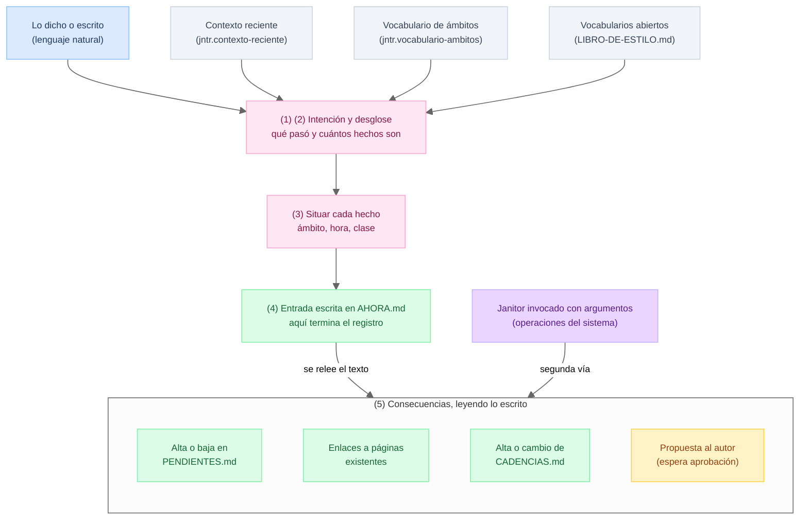

# TUKU: Libro de estilo

> Este documento gobierna el vault del autor: cómo se escribe, cómo se organiza y cómo interactúan personas, agentes y janitors. Es la referencia canónica viva.

---

## 1. El Flujo de la Información

El flujo no depende de quién lo ejecute: debe poder entregarse como instructivo a una persona contratada para llevar la bitácora y funcionar exactamente igual.

### La frontera estricta

Registrar produce **una sola cosa**: texto escrito en la bitácora (`AHORA.md`). Recién cuando el texto está escrito se aplican las consecuencias, y se aplican **leyendo lo escrito**, no recordando la conversación.

Esta frontera parte el sistema en dos mitades:
- **Antes de la frontera:** requiere juicio para entender qué ocurrió en lenguaje natural.
- **Después de la frontera:** no requiere juicio; es lectura determinista de un texto ya formado.

Regla de oro: **toda consecuencia debe ser derivable del texto de la entrada.** Si algo solo se puede hacer recordando la conversación, entonces o a la entrada le falta información o la operación pertenece a la segunda vía.

### Qué entra al sistema

Entran cuatro elementos esenciales:
1. **Lo dicho o escrito:** por el autor en lenguaje natural.
2. **Contexto reciente:** provisto por `jntr.contexto-reciente` desde las últimas entradas de `AHORA.md`.
3. **Vocabulario de ámbitos:** provisto por `jntr.vocabulario-ambitos` desde los frontmatter de `ambitos/`.
4. **Vocabularios abiertos:** provistos por `LIBRO-DE-ESTILO.md` bajo sus encabezados canónicos.

### Los cinco pasos

1. **Separar lo dirigido al sistema de lo que pasó:** "Recuérdame", "anota", "oye" son instrucciones a quien lleva la bitácora; no son parte del hecho y se descartan.
2. **Partir en hechos:** una sola frase puede contener varios hechos (un cierre propio y la respuesta de un tercero son hechos distintos).
3. **Situar cada hecho:** determinar a qué ámbito pertenece, a qué hora ocurrió y qué clase tiene.
4. **Redactar y escribir la entrada en `AHORA.md`:** respetando el formato canónico. **Aquí termina el registro.**
5. **Releer lo escrito y aplicar consecuencias:** ejecutar las consecuencias deterministas leyendo el texto redactado.

### Las dos vías de modificación

No todo entra por la voz. Existen dos puertas hacia la misma sala:



| Vía | Origen | Ejemplos | Mecanismo |
|---|---|---|---|
| **Vía 1: Bitácora** | Hechos de la vida del autor | "Compré pintura", "Avisé del arriendo" | Entrada en `AHORA.md` $\to$ janitor relee texto |
| **Vía 2: Directa** | Operaciones del sistema | Mover pendiente de escalón, corregir plan, aprobar propuesta | Invocación directa del janitor con argumentos |

---

## 2. Anatomía de los Archivos del Vault

<!-- #TODO: pasar a reglas/templates/ lo que corresponda de la anatomía de archivos. -->

### `AHORA.md` — El ciclo en curso

Lo único canónico aquí son las **entradas de bitácora**. El plan y los pendientes del día entran por **transclusión viva** (`![[...]]`). No lleva resumen mientras está abierto.

```markdown
---
ciclo: semanal
desde: 2026-08-25
hasta: 2026-09-01
---

# Plan

![[planes/plan-2026-08-25-semanal.md]]

# Actividad diaria

## Martes 25 de agosto
![[PENDIENTES.md#^2026-08-25]]
- 09:12 - [[arriendo-depto-centro]] **pendiente**: avisar de los GGCC al arrendatario
- 14:30 - [[trabajo/observatorio]] **progreso**: compilado de nuevo driver completado

## Miércoles 26 de agosto
![[PENDIENTES.md#^2026-08-26]]
```

### `bitacoras/bitacora-<desde>-<hasta>.md` — El ciclo cerrado

Al cerrar un ciclo, el plan y los pendientes se **aplanan a texto plano** para garantizar legibilidad a 20 años sin depender de transclusiones. El resumen se enlaza como documento externo.

```markdown
---
ciclo: semanal
desde: 2026-08-25
hasta: 2026-09-01
---

# Plan

(texto del plan aplanado)

# Actividad diaria

## Martes 25 de agosto
(pendientes de ese día aplanados)
- 09:12 - [[arriendo-depto-centro]] **pendiente**: avisar de los GGCC al arrendatario
- 14:30 - [[trabajo/observatorio]] **progreso**: compilado de nuevo driver completado

# Resumen del ciclo

[Resumen del ciclo](../reportes/resumen-2026-08-25-semanal.md)
```

### `PENDIENTES.md` — Fuente de verdad única

Es **fuente canónica, nunca derivado**. Se estructura mediante callouts con anclas permanentes (horizontes) y efímeras (fechas ISO):

```text
> [!TODO] pendientes atrasados ^atrasados
> - [[arriendo-depto-centro]] - avisar de los GGCC (vencía 2026-04-02)

> [!TODO] pendientes sin fecha ^sin-fecha
> - [[casa/reparaciones]] - comprar pintura para el garaje

> [!TODO] pendientes de este ciclo ^este-turno
> - [[trabajo/observatorio]] - revisar PR del linter

> [!TODO] pendientes del proximo ciclo ^proximo-turno
> - [[personal/salud]] - agendar hora al dentista

> [!TODO] pendientes del 2026-08-25 ^2026-08-25
> - [[arriendo-depto-centro]] - enviar comprobante de pago
```

#### Reglas de Pendientes:
1. **Unicidad:** Cada pendiente está en exactamente un callout.
2. **Formato del ítem:** `- [[ambito]] - cuerpo`. Toda información temporal vive en el título del callout.
3. **Regla del infinitivo y correspondencia literal:** `**pendiente**: cuerpo` abre; `~~(Hecho)~~: cuerpo` cierra borrando el ítem idéntico sin LLM.
4. **Escalera de horizontes:** `sin-fecha` $\to$ horizonte con nombre (`este-turno`, `proximo-turno`, `fin-de-mes`) $\to$ fecha exacta (`^YYYY-MM-DD`) $\to$ cerrado.
5. **Vencimiento:** Lo fechado antes de HOY pasa a `^atrasados` con el vencimiento estampado entre paréntesis.
6. **Sincronía de transclusiones:** `jntr.transclusiones-sync` asegura que toda ancla fechada tenga su transclusión en `AHORA.md` y que no existan cajas rotas.

### `CADENCIAS.md` — Recordatorios y rutinas recurrentes

Vive en el ámbito correspondiente y contiene solo las cadencias de esa carpeta:

```markdown
## Gastos comunes del arriendo

**Cuándo:** día exacto 10, mensual
**Emite:** pendiente con fecha
**Texto:** pagar y enviar comprobante de gastos comunes a [[carmen-navarro]]

### Procedimiento
Pagar en el portal y enviar el comprobante por mensajería.

### Historia
- 2026-08-09: el comprobante se envía el mismo día para evitar cobro duplicado.
```

- **Campos de máquina:** `Cuándo` (condición de disparo por calendario y tipo de ciclo), `Emite` (tipo de primitivo), `Texto` (cuerpo literal sin LLM).
- **Campos de persona:** `Procedimiento` (instrucciones operativas), `Historia` (contexto fechado del porqué de la regla).
- **Inyección retrospectiva:** Al definir una cadencia nueva, se inyecta desde HOY hasta el final del ciclo en curso si corresponde, con **idempotencia estricta** (no duplica si ya fue sembrada).

### `ambitos/` — El árbol de la vida

- **Ámbito:** Directorio con página propia (`personal.md`, `trabajo.md`).
- **Categoría:** Directorio agrupador sin página propia (`clientes/`).
- **Actividad:** Archivo `.md` hoja en minúsculas (`juanito_perez.md`).
- Todo directorio lleva `AGENTS.md` y `CADENCIAS.md` obligatorios.

### `notas/` — Zettelkasten y notas tipadas

Espacio mental global. Las notas libres tienen formato abierto. Las **notas tipadas** definen `tipo:` en su frontmatter (ej. `tipo: persona`) y se destilan desde el histórico en **contexto aislado** (`jntr.nota-destilar`).

---

## 3. Reglas de Bitácora y Redacción

### Hablado vs. Registrado

El dictado va dirigido a quien escucha; la entrada registra el hecho para los próximos veinte años:
1. **Se registra el hecho, no la conversación:** Fuera rodeos ("recuérdame", "anota"). La unidad es el hecho: una frase puede generar múltiples entradas.
2. **La entrada se sostiene sola:** Deícticos resueltos, personas con su rol la primera vez, tiempo relativo transformado en fecha.
3. **No se agrega lo que no se dijo:** Lo que el hecho sugiere se formula como propuesta y espera aprobación.
4. **La forma la fija la marca:** `**pendiente**` en infinitivo; `~~(Hecho)~~` repite el cuerpo literal; los demás hechos en pasado y primera persona; observaciones vigentes en presente.

### Formato canónico de entrada

```text
- HH:MM - [[ambito]] ~~(Hecho)~~ **clasificacion**: cuerpo
```

- La marca cerrada (`~~(Hecho)~~`) y la clasificación abierta (`**clasificacion**`) van en esa misma zona, después del ámbito, y ambas son opcionales según corresponda.

### Ontología dual

1. **Cerrada (de TUKU, en código del linter):** `**pendiente**`, `~~(Hecho)~~`, `**cadencia**`. Son mecánicas y disparan consecuencias deterministas.
2. **Abierta (del autor, en este documento):** Semánticas. El linter las valida de forma permisiva.

---

## 4. Encabezados como Contrato

> [!IMPORTANT]
> Los siguientes encabezados son leídos directamente por los janitors para extraer el vocabulario controlado. Renombrarlos rompe las automatizaciones del sistema.

### Clasificaciones

| Clasificación | Semántica y propósito |
|---|---|
| `progreso` | Avance concreto en una tarea, entrega o proyecto. |
| `decisión` | Elección fundamentada y su justificación explícita. |
| `fricción` | Bloqueo o costo operativo sobre la propia ejecución del autor. |
| `señal` | Patrón emergente o evento externo que merece atención más allá del ciclo. |
| `nota` | Registro factual general que no calza en las clasificaciones anteriores. |

### Horizontes

| Horizonte | Significado | Callout en PENDIENTES.md |
|---|---|---|
| `atrasados` | Tareas fechadas previas a HOY con vencimiento estampado. | `^atrasados` |
| `sin-fecha` | Tareas abiertas sin horizonte temporal asignado. | `^sin-fecha` |
| `este-turno` | Tareas comprometidas para el ciclo en curso. | `^este-turno` |
| `proximo-turno` | Tareas planificadas para el ciclo siguiente. | `^proximo-turno` |
| `fin-de-mes` | Tareas a completar antes del cierre de mes calendario. | `^fin-de-mes` |

### Tipos de nota

| Tipo de nota | Definición | Reglas especiales |
|---|---|---|
| `persona` | Registro de relación y colaboración con un tercero. | Redactar solo lo que se le podría mostrar a la persona. Foco en colaborar mejor, no en juzgar. |
| `sistema` | Ficha técnica de arquitectura, software o servicio. | Estado, dependencias y procedimientos de operación. |
| `reunion-recurrente` | Bitácora y acuerdos de mesas de trabajo continuas. | Registro de asistentes, acuerdos y seguimiento de compromisos. |

---

## 5. Planes, Resúmenes y Ciclos

### Capacidad del plan
Se calcula restando el **costo fijo diario** (roles operativos, compromisos familiares, traslados) a las horas brutas del ciclo (`jntr.capacidad-calcular`). Se planifica contra la capacidad neta resultante.

### Estructura del plan (`planes/plan-<desde>-<ciclo>.md`)
1. **Intención del ciclo:** lista corta de focos por ámbito y su acción principal.
2. **No entra, y por qué:** lo que explícitamente se deja fuera (pospone pendientes y silencia alertas de ausencia).
3. **Restricciones y contexto:** factores que acotan el ciclo antes de empezar.
4. **Señales a vigilar:** qué observar durante el ciclo sin que sea tarea.

### Estructura del resumen (`reportes/resumen-<desde>-<ciclo>.md`)
1. **Resumen ejecutivo:** tema dominante y foco urgente.
2. **Veredicto por intención:** cumplida, parcial, en riesgo o sin avance (comparando plan contra ejecución).
3. **Desglose por ámbito:** estado de pendientes y actividad realizada.
4. **Emergente:** lo ocurrido sin haber estado en el plan.
5. **Momentum y señales:** logros estructurales y patrones a vigilar.

---

## 6. Apertura y Cierre de Ciclos

### Apertura de ciclo (secuencia ordenada)
1. Crear `AHORA.md` con frontmatter (`ciclo`, `desde`, `hasta`) $\to$ `jntr.ciclo-abrir`.
2. Sembrar los días del ciclo con encabezados `## Día, DD de MM` $\to$ `jntr.ciclo-abrir`.
3. Rodar y promover pendientes (`este-turno` rueda, `proximo-turno` asciende) $\to$ `jntr.pendientes-promover`.
4. Colectar cadencias del árbol y sembrar en los días correspondientes $\to$ `jntr.cadencias-colectar`, `jntr.cadencias-resolver`, `jntr.cadencia-inyectar`.
5. Proponer el plan en `planes/` y transcluirlo en `AHORA.md` $\to$ `jntr.capacidad-calcular`.
6. Sincronizar transclusiones de pendientes fechados $\to$ `jntr.transclusiones-sync`.

### Cierre de ciclo (secuencia ordenada)
1. Generar el resumen en `reportes/` leyendo el plan y entradas vivas $\to$ `jntr.ciclo-extracto`.
2. Aplanar el plan y los pendientes del día a texto plano en `AHORA.md` $\to$ `jntr.transclusiones-aplanar`.
3. Dejar el enlace markdown al resumen $\to$ `jntr.ciclo-cerrar`.
4. Mover el archivo cerrado a `bitacoras/bitacora-<desde>-<hasta>.md` $\to$ `jntr.ciclo-cerrar`.
5. Dejar `AHORA.md` limpio y preparado para el siguiente ciclo $\to$ `jntr.ciclo-cerrar`.

---

## 7. Matriz de Reglas y Responsabilidades

| Regla | Responsable | Validación |
|---|---|---|
| Toda entrada cumple con formato `- HH:MM - [[ambito]] ...` | janitor (`jntr.entrada-lint`) | Estricta |
| Ontología cerrada (`**pendiente**`, `~~(Hecho)~~`, `**cadencia**`) válida | janitor (`jntr.entrada-lint`) | Estricta |
| Clasificación abierta pertenece a `### Clasificaciones` | janitor (`jntr.entrada-lint`) | Permisiva (reporta, nunca rechaza) |
| Todo `[[enlace]]` resuelve a una página existente | janitor (`jntr.enlaces-lint`) | Estricta |
| Todo directorio en `ambitos/` tiene `AGENTS.md` y `CADENCIAS.md` | janitor (`jntr.ambitos-lint`) | Estricta |
| Una entrada nunca apunta a una categoría sin página propia | janitor (`jntr.ambitos-lint`) | Estricta |
| Ningún pendiente aparece duplicado en dos callouts | janitor (`jntr.pendientes-lint`) | Estricta |
| Sincronía bidireccional entre callouts fechados y transclusiones de `AHORA.md` | janitor (`jntr.transclusiones-sync`) | Estricta |
| Abrir pendiente copia cuerpo literal; cerrar pendiente borra cuerpo literal | janitor (`jntr.pendiente-abrir`, `jntr.pendiente-cerrar`) | Determinista |
| Presencia de sección "Ver además" y motivo tras cada enlace | janitor (`jntr.notas-lint`) | Estricta |
| Calidad y pertinencia del motivo en "Ver además" | agente | Juicio semántico |
| Emparejamiento semántico de hechos ambiguos no literales | agente | Consulta al autor |
| Notas de persona redactadas como observación respetuosa | agente | Juicio ético |