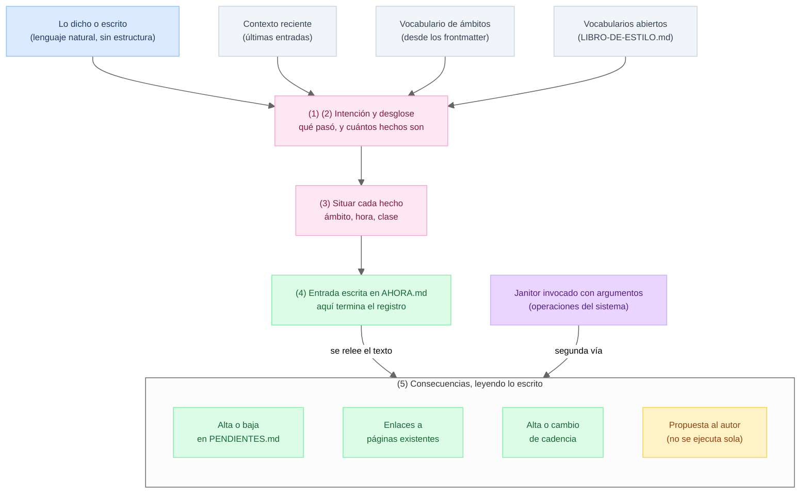

# spec · flujo de la información

> El marco al que sirven las demás specs. Se justifica por el principio 3 y el principio 4 de [`../docs/principios.md`](../docs/principios.md).

El flujo no depende de quién lo ejecute. Debe poder entregarse como instructivo a una persona contratada para llevar la bitácora, y funcionar igual. Lo que cambia cuando el ejecutor es un agente de IA está en [agente.md](agente.md), no aquí.

## La frontera

Registrar produce **una sola cosa**: texto escrito en la bitácora. Recién cuando el texto está escrito se aplican las consecuencias, y se aplican **leyendo lo escrito**, no recordando la conversación.

Esa frontera parte el flujo en dos mitades con naturalezas distintas. Antes de ella hace falta juicio, porque hay que entender qué pasó. Después de ella no hace falta ninguno: todo lo que sigue es leer un texto que ya está formado.

De ahí sale la regla de diseño más exigente de TUKU: **toda consecuencia tiene que ser derivable del texto de la entrada.** Si algo solo se puede hacer recordando lo que se dijo, entonces o a la entrada le falta información, o esa operación no pertenece a este flujo y hay que decirlo.

## Qué entra

No entra solo la voz. Entran cuatro cosas y ninguna es opcional, porque una persona nueva necesitaría exactamente las mismas cuatro el primer día:

| Qué | De dónde sale | Sin esto no se puede |
| --- | --- | --- |
| Lo dicho o escrito | del autor, en lenguaje natural | nada |
| Contexto reciente | `jntr.contexto-reciente` | evitar repreguntar o duplicar lo ya escrito |
| Vocabulario de ámbitos | `jntr.vocabulario-ambitos`, desde los frontmatter | elegir ámbito, porque no se sabe cuáles existen |
| Vocabularios abiertos | `LIBRO-DE-ESTILO.md`, en sus tres subtítulos | elegir clasificación |

## Los cinco pasos

1. **Separar lo dirigido al sistema de lo que pasó.** "Recuérdame", "anota", "oye" son instrucciones a quien lleva la bitácora. No son parte del hecho y no se registran.
2. **Partir en hechos.** Una sola frase puede contener varios: un cierre propio y la respuesta de un tercero son dos hechos distintos.
3. **Situar cada hecho.** A qué ámbito pertenece, a qué hora ocurrió y de qué clase es.
4. **Redactar y escribir** la entrada en `AHORA.md`, según las reglas de bitácora (`bitacora.md`). **Acá termina el registro.**
5. **Releer lo escrito y aplicar las consecuencias.** Cada tipo tiene su archivo en `reglas/` y se carga solo cuando corresponde.

El orden importa en dos puntos, y por razones distintas. Antes del paso 4, porque redactar sin haber desglosado produce una entrada por frase y la unidad es el hecho. Antes del paso 5, porque la fuente de la consecuencia es el texto, y si todavía no existe no hay de dónde leer.

## La segunda vía

No todo entra por la voz. Mover un pendiente de escalón, corregir el plan, aprobar o rechazar una propuesta son operaciones del sistema y no hechos de la vida del autor, y ya está decidido que no se registran. Entran **invocando el janitor directamente** y desembocan en las mismas consecuencias.

Son dos puertas y una sola sala. Eso es lo que hace que la plataforma de pruebas sea chica: se inyecta una línea de texto, o se invoca un janitor con argumentos, y no hay una tercera forma de que algo cambie en el vault.

Las cajas rosadas son las que necesitan juicio, y son las únicas. Todo lo verde se obtiene leyendo.

## Las consecuencias

| Consecuencia | Qué hace | Reglas | Janitors |
| --- | --- | --- | --- |
| Pendientes | Alta o baja en `PENDIENTES.md` | `reglas/pendientes.tuku.md` | `jntr.pendiente-abrir`, `jntr.pendiente-cerrar` |
| Enlaces | Conecta la entrada con páginas que ya existen | `reglas/enlaces.tuku.md` | `jntr.paginas-index`, `jntr.menciones-enlazar` |
| Cadencias | Alta o cambio de una cadencia en su ámbito | `reglas/cadencias.tuku.md` | `jntr.cadencia-alta`, `jntr.cadencia-inyectar` |
| Propuesta | Sugiere algo al autor y espera aprobación | `reglas/propuestas.tuku.md` | sin janitor, a propósito |

La lista es **abierta** y va a crecer a medida que el uso la revele. Agregar una consecuencia es agregar un archivo en `reglas/`, no tocar el flujo. Esa es la prueba de que el corte está bien hecho.

Un solo dictado puede producir varias entradas y varios cambios, porque cada hecho del desglose arrastra los suyos. **La propuesta es la única que no se ejecuta:** se muestra y espera. Es el principio 3 metido dentro del flujo, y es la razón de que no tenga janitor: una propuesta rechazada no escribe nada, así que no hay nada que limpiar.

## No entra

- El detalle del formato de cada archivo (`AHORA.md`, `PENDIENTES.md`, `CADENCIAS.md`). Eso vive en [`ciclo.md`](ciclo.md), [`pendientes.md`](pendientes.md) y [`cadencias.md`](cadencias.md) respectivamente.
- Cómo se comporta un agente de IA frente a este flujo (silencio por defecto, carga diferida de reglas, reparto entre LLM y script). Eso es [`agente.md`](agente.md).
