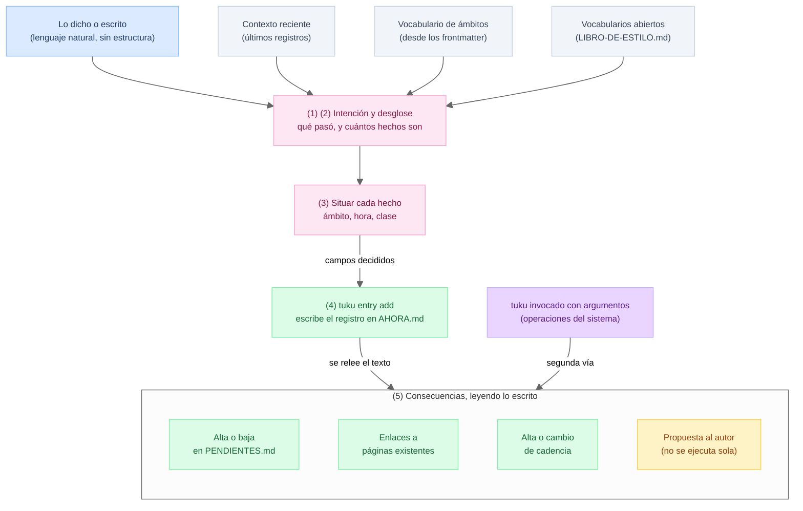

# spec · flujo de la información

> El marco al que sirven las demás specs. Se justifica por el principio 3 y el principio 4 de [`../docs/principios.md`](../docs/principios.md).

El flujo no depende de quién lo ejecute. Debe poder entregarse como instructivo a una persona contratada para llevar la bitácora, y funcionar igual. Lo que cambia cuando el ejecutor es un agente de IA está en [agente.md](agente.md), no aquí.

## La frontera

Registrar produce **una sola cosa**: texto escrito en la bitácora. Recién cuando el texto está escrito se aplican las consecuencias, y se aplican **leyendo lo escrito**, no recordando la conversación.

Esa frontera parte el flujo en dos mitades: antes se registra, después se aplican consecuencias. **No es la misma línea que separa el juicio del determinismo**, y conviene no confundirlas. El juicio termina antes: se acaba en el paso 3, cuando cada hecho ya tiene ámbito, hora y clase. Construir la línea con esos campos ya es mecánico, igual que leerla después.

| | Pasos | Naturaleza |
| --- | --- | --- |
| Decidir | 1 a 3 | Juicio: entender qué pasó y situarlo |
| Ejecutar | 4 y 5 | Determinista: construir la línea, y leerla para actuar |

La frontera cae dentro de la mitad determinista, entre el 4 y el 5. Sigue importando, porque fija de dónde sale la consecuencia, pero no es donde se acaba el juicio.

De ahí sale la regla de diseño más exigente de TUKU: **toda consecuencia tiene que ser derivable del texto del registro.** Si algo solo se puede hacer recordando lo que se dijo, entonces o al registro le falta información, o esa operación no pertenece a este flujo y hay que decirlo.

## Qué entra

No entra solo la voz. Entran cuatro cosas y ninguna es opcional, porque una persona nueva necesitaría exactamente las mismas cuatro el primer día:

| Qué | De dónde sale | Sin esto no se puede |
| --- | --- | --- |
| Lo dicho o escrito | del autor, en lenguaje natural | nada |
| Contexto reciente | `tuku context show` | evitar repreguntar o duplicar lo ya escrito |
| Vocabulario de ámbitos | `tuku vocab show`, desde los frontmatter | elegir ámbito, porque no se sabe cuáles existen |
| Vocabularios abiertos | `tuku vocab show`, desde los tres subtítulos de `LIBRO-DE-ESTILO.md` | elegir clasificación |

Las tres que salen del vault llegan **por un comando y no leyendo archivos**. Quien ejecuta no tiene que saber dónde vive cada cosa ni en qué formato: eso lo sabe el comando. De ahí que lo único que hay que cargar sea lo que se usa para decidir, nunca lo que se usa para escribir (ver [cli.md](cli.md) y [agente.md](agente.md)).

## Los cinco pasos

1. **Separar lo dirigido al sistema de lo que pasó.** "Recuérdame", "anota", "oye" son instrucciones a quien lleva la bitácora. No son parte del hecho y no se registran.
2. **Partir en hechos.** Una sola frase puede contener varios: un cierre propio y la respuesta de un tercero son dos hechos distintos.
3. **Situar cada hecho.** A qué ámbito pertenece, a qué hora ocurrió y de qué clase es.
4. **Escribir el registro** en `AHORA.md`. Los campos ya quedaron decididos en el paso 3, así que construir la línea canónica con ellos, ponerla en el día que corresponde y mantener el orden es mecánico: lo hace `tuku entry add` (formato en [bitacora.md](bitacora.md), reparto en [cli.md](cli.md)). **Acá termina el registro.**
5. **Releer lo escrito y aplicar las consecuencias.** Cada tipo tiene su archivo en `reglas/` y se carga solo cuando corresponde.

El orden importa en dos puntos, y por razones distintas. Antes del paso 4, porque redactar sin haber desglosado produce un registro por frase y la unidad es el hecho. Antes del paso 5, porque la fuente de la consecuencia es el texto, y si todavía no existe no hay de dónde leer.

## La segunda vía

No todo entra por la voz. Abrir o cerrar un pendiente, moverlo de escalón, crear una nota o dar de alta un ámbito entran **invocando `tuku` directamente**. Toda acción que represente una decisión del autor sobre sus compromisos o su estructura deja huella en la bitácora: el comando estampa su constancia cronológica en `AHORA.md` a la vez que actualiza la tabla o archivo correspondiente.

Son dos puertas y una sola sala, y desde que la mitad determinista vive en el comando, la sala tiene un solo mecanismo: **las dos vías terminan en una invocación de `tuku`**. La primera la compone quien interpretó el dictado, la segunda la escribe el autor. Toda invocación es estrictamente idempotente: correr un comando repetidas veces no duplica líneas en la bitácora ni filas en las tablas. Si un elemento ya existe en un archivo, se omite y se asegura que el estado complementario quede sincronizado.

Esa invariante es sobre lo automatizado y no sobre el autor. A mano el vault se edita como cualquier carpeta de archivos de texto, que es el principio 1, y por eso cada comando declara su equivalente manual (ver [README.md](README.md), el campo "A mano"). Lo que no existe es una tercera forma de que algo cambie **solo**: nada automático toca el vault fuera de un comando. Eso es lo que mantiene chica la plataforma de pruebas, y lo que hace que una sesión se pueda releer y volver a ejecutar.

Las cajas rosadas son las que necesitan juicio, y son las únicas: el juicio se acaba cuando los campos están decididos. Todo lo verde lo ejecuta un comando, sea escribiendo la línea o leyéndola para actuar.

## Las consecuencias

| Consecuencia | Qué hace | Reglas | Comandos |
| --- | --- | --- | --- |
| Pendientes | Alta o baja en `PENDIENTES.md`, y las vistas que se derivan de él | `reglas/pendientes.tuku.md` | `todo open`, `todo close`, `todo propagate` |
| Enlaces | Conecta el registro con páginas que ya existen | `reglas/enlaces.tuku.md` | `page index`, `link backfill` |
| Cadencias | Alta o cambio de una cadencia en su ámbito | `reglas/cadencias.tuku.md` | `cadence add`, `cadence inject` |
| Nota | Escribe en `notas/` lo que el autor pidió, y deja constancia en la bitácora | `reglas/notas.tuku.md` | `note create`, `note lint` |
| Propuesta | Sugiere algo al autor y espera aprobación | `reglas/propuestas.tuku.md` | sin comando, a propósito |

La lista es **abierta** y va a crecer a medida que el uso la revele. Agregar una consecuencia es agregar un archivo en `reglas/`, no tocar el flujo. Esa es la prueba de que el corte está bien hecho.

Un solo dictado puede producir varios registros y varios cambios, porque cada hecho del desglose arrastra los suyos. **La propuesta es la única que no se ejecuta:** se muestra y espera. Es el principio 3 metido dentro del flujo, y es la razón de que no tenga comando: una propuesta rechazada no escribe nada, así que no hay nada que limpiar. La forma general de eso está en [cli.md](cli.md), "ante la duda, informar y no escribir".

## No entra

- El detalle del formato de cada archivo (`AHORA.md`, `PENDIENTES.md`, `CADENCIAS.md`). Eso vive en [`ciclo.md`](ciclo.md), [`pendientes.md`](pendientes.md) y [`cadencias.md`](cadencias.md) respectivamente.
- Cómo se comporta un agente de IA frente a este flujo (silencio por defecto, carga diferida de reglas, reparto entre LLM y script). Eso es [`agente.md`](agente.md).
- Qué garantiza un comando, con qué códigos sale y cómo informa. Eso es [`cli.md`](cli.md). Acá se dice **dónde** cae el comando dentro del flujo, no cuál es su contrato.
